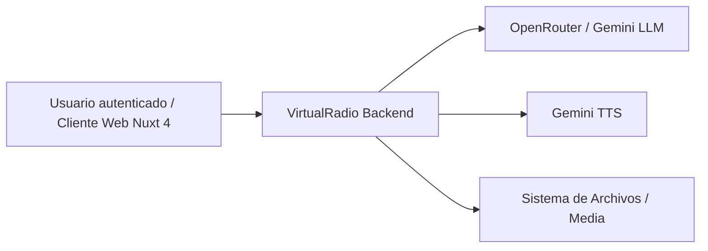
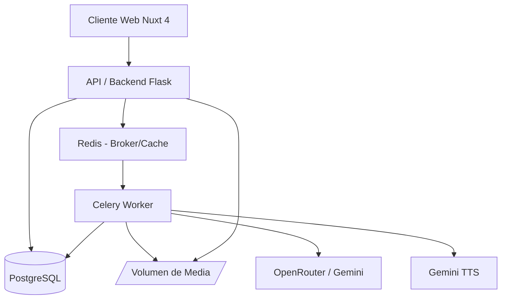
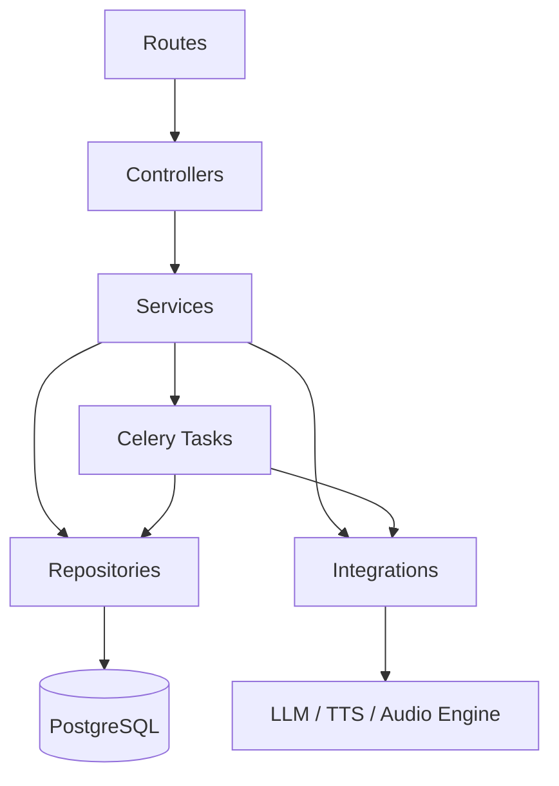

# Arquitectura del Proyecto – VirtualRadio (Backend)

## 1. Información General

**Proyecto:** VirtualRadio – API Backend

**Versión del Documento:** 1.0

**Fecha:** 2026-06-15

**Responsables:** Equipo de Plataforma / Backend

**Descripción General**
Este documento describe la arquitectura técnica del backend de **VirtualRadio**, una plataforma que genera de forma automatizada programas de radio satíricos (estilo WCTR) para videojuegos de simulación (Farming Simulator 25, Euro Truck Simulator 2, etc.). El backend expone una API REST (Flask) que orquesta una biblioteca musical local, un universo narrativo compartido (noticias, comerciales, personajes y memoria narrativa) y un pipeline de generación por agentes que produce episodios de audio listos para reproducir. Incluye sus decisiones de diseño, estructura de componentes, flujos principales y estándares de desarrollo. El objetivo es servir como referencia corporativa para equipos técnicos, stakeholders y auditorías futuras.

---

## 2. Alcance del Documento

Este documento cubre:
- Arquitectura de software a nivel sistema
- Principales decisiones arquitectónicas (ADR)
- Estructura del proyecto y convenciones
- Patrones de diseño y principios técnicos

Fuera de alcance:
- Detalles de implementación específicos de bajo nivel
- Manuales de operación o despliegue
- Esquema de base de datos a nivel campo (ver `docs/backend/base-de-datos.md`)
- Modelo de permisos detallado (ver `docs/backend/rbac.md`)
- Arquitectura del cliente web (ver `docs/frontend/arquitectura-frontend.md`)

---

## 3. Contexto del Sistema (C4 – Nivel 1)

### 3.1 Descripción

VirtualRadio es consumido por **usuarios autenticados** (creadores de contenido para simuladores) a través de un cliente web (Nuxt 4). Cada usuario es **dueño de sus propios datos** (estaciones, biblioteca musical, episodios y universo narrativo). El backend se apoya en varios sistemas externos:

- **OpenRouter** (LLM `google/gemini-2.5-flash`) y **Google Gemini API** para la generación de guiones y sugerencias de contenido.
- **Gemini TTS** para la síntesis de voz de los locutores, llamadas y comerciales.
- **Sistema de archivos** (volumen) para la biblioteca musical de entrada y los episodios MP3 generados.

El backend nunca expone datos de un usuario a otro; toda operación se filtra por el propietario autenticado.

### 3.2 Diagrama de Contexto



---

## 4. Contenedores del Sistema (C4 – Nivel 2)

### 4.1 Descripción de Contenedores

| Contenedor | Tecnología | Responsabilidad |
|-----------|------------|-----------------|
| API / Backend | Flask 3 + Gunicorn (Python 3.12) | Exponer la API REST, autenticación JWT, CRUD del universo y encolado de jobs |
| Worker | Celery (Python 3.12) + FFmpeg/pydub | Ejecutar el pipeline de generación de episodios en segundo plano |
| Base de Datos | PostgreSQL 18.5 | Persistencia de usuarios, catálogo de roles (RBAC), universo narrativo, episodios y estado de jobs (IDs UUIDv7 nativo) |
| Mensajería / Cache | Redis 8 | Broker y result backend de Celery; cache de respuestas del LLM e índice de voces Gemini TTS (el binario de voz vive en el volumen de media) |
| Almacenamiento de Media | Volumen Docker (sistema de archivos) | Biblioteca musical de entrada, cache de voces y episodios MP3 exportados |

### 4.2 Diagrama de Contenedores



---

## 5. Componentes Principales (C4 – Nivel 3)

### 5.1 Organización Lógica

El sistema se organiza siguiendo una arquitectura por capas con separación clara de responsabilidades. Se aplica el patrón *application factory* de Flask y un **Blueprint por recurso**.

| Capa | Responsabilidad |
|-----|-----------------|
| Routes (Blueprints) | Exposición de endpoints REST, validación de entrada (schemas) y autenticación |
| Controllers | Orquestación de requests, transformación de DTOs y respuestas |
| Services | Lógica de negocio: gestión del universo, planificación y ensamblado de episodios |
| Repositories (Modelos SQLAlchemy) | Acceso a datos con filtrado por `owner_id` |
| Integrations | Servicios externos: LLM (OpenRouter/Gemini), TTS, motor de audio (FFmpeg/pydub) |
| Tasks (Celery) | Ejecución asíncrona del pipeline de generación |

Los **agentes de generación** (Episode Planner, News, Commercial, Character, Host, Episode Assembly) viven dentro de la capa de *Services/Tasks* como módulos especializados que colaboran para construir el JSON del episodio.

### 5.2 Diagrama de Componentes



---

## 6. Stack Tecnológico

### 6.1 Tecnologías Principales

- Runtime: Python 3.12 / Gunicorn / Celery worker
- Lenguaje: Python
- Framework: Flask 3 (application factory + Blueprints)
- Persistencia: PostgreSQL 18.5 con SQLAlchemy 2.x (ORM) + Alembic/Flask-Migrate (migraciones); IDs en UUIDv7 nativo (`uuidv7()`)
- Mensajería / Cache: Redis 8 (broker y result backend de Celery, cache)

### 6.2 Herramientas de Soporte

- Testing: pytest + pytest-flask + factory_boy
- Linting / Formatting: ruff + black + mypy
- Observabilidad: logging estructurado (JSON) + healthchecks; métricas de jobs vía Flower (Celery)
- Validación: Marshmallow (schemas de request/response)
- Audio: FFmpeg + pydub; síntesis de voz vía Gemini TTS
- Autenticación: Flask-JWT-Extended

---

## 7. Estructura del Proyecto

```
backend/
├── app/
│   ├── routes/          # Blueprints por recurso (auth, stations, episodes, news, ...)
│   ├── controllers/     # Orquestación de requests
│   ├── services/        # Lógica de negocio
│   │   └── agents/      # Episode Planner, News, Commercial, Character, Host, Assembly
│   ├── repositories/    # Acceso a datos (queries con filtro por owner_id)
│   ├── models/          # Modelos SQLAlchemy
│   ├── integrations/    # llm_client, tts_client, audio_engine
│   ├── schemas/         # Schemas Marshmallow
│   ├── tasks/           # Tareas Celery (pipeline de generación)
│   ├── seeds/           # Datos por defecto (estaciones, marcas, comerciales, personajes, noticias) y catálogo de roles
│   ├── config/          # Configuración por entorno
│   ├── extensions.py    # db, migrate, jwt, celery
│   └── __init__.py      # create_app() (application factory)
├── migrations/          # Migraciones Alembic
├── tests/
├── celery_worker.py
├── wsgi.py
├── requirements.txt
├── Dockerfile
└── docker-compose.yml
```

---

## 8. Convenciones de API

### 8.1 Convención de URLs

```
/api/v1/{modulo}/{recurso}
```

Ejemplos: `/api/v1/auth/login`, `/api/v1/stations`, `/api/v1/episodes/generate`, `/api/v1/jobs/{id}`.

### 8.2 Estructura de Respuestas

**Respuesta Exitosa**
```json
{
  "data": {},
  "meta": {}
}
```

**Respuesta de Error**
```json
{
  "error": {
    "code": "ERROR_CODE",
    "message": "Descripción del error",
    "details": {}
  }
}
```

---

## 9. Seguridad

- Autenticación: **JWT** (Flask-JWT-Extended). `POST /api/v1/auth/login` emite un access token y un refresh token; `POST /api/v1/auth/refresh` renueva el access token a partir de un refresh token válido.
- Autorización: **RBAC** con un único rol de sistema `USER` y scope `own`; cada consulta se filtra por `owner_id == current_user.id` (ver `docs/backend/rbac.md`).
- Principio de mínimo privilegio aplicado: un usuario solo accede a sus propios recursos.
- Contraseñas almacenadas con hash fuerte (bcrypt/argon2). Secretos y API keys (OpenRouter/Gemini) inyectados por variables de entorno.

---

## 10. Manejo de Errores

| Código | Significado |
|------|-------------|
| 400 | Bad Request |
| 401 | Unauthorized |
| 403 | Forbidden |
| 404 | Not Found |
| 422 | Validation Error |
| 500 | Internal Server Error |

---

## 11. Principios Arquitectónicos

- Separación de responsabilidades
- Escalabilidad y mantenibilidad
- Observabilidad desde el diseño
- Seguridad por defecto
- Resiliencia de la generación: el pipeline tiene fallback procedural cuando el LLM no responde, garantizando siempre un episodio válido.

---

## 12. Architecture Decision Records (ADR)

Las decisiones arquitectónicas relevantes deben documentarse siguiendo el formato ADR.

### 12.1 Formato ADR

| Campo | Descripción |
|-----|------------|
| ID | ADR-XXX |
| Fecha | YYYY-MM-DD |
| Estado | Propuesto / Aceptado / Deprecado |
| Contexto | Situación que motiva la decisión |
| Decisión | Decisión tomada |
| Consecuencias | Impactos positivos y negativos |

### 12.2 Registro de ADRs

| ID | Fecha | Estado | Decisión |
|----|-------|--------|----------|
| ADR-001 | 2026-06-15 | Aceptado | Migrar de SQLite + SQL crudo a PostgreSQL con SQLAlchemy + Alembic |
| ADR-002 | 2026-06-15 | Aceptado | Reemplazar la ejecución por hilos (`threading`) y el dict en memoria por Celery + Redis con estado persistido en `generation_jobs` |
| ADR-003 | 2026-06-15 | Aceptado | Introducir autenticación JWT con un único rol `USER` y aislamiento de datos por `owner_id` (scope `own`) |
| ADR-004 | 2026-06-15 | Aceptado | Empaquetar todos los servicios con Docker / docker-compose (api, worker, db, redis, frontend) |
| ADR-005 | 2026-06-15 | Aceptado | Mantener el fallback procedural del pipeline como red de seguridad ante fallos del LLM |
| ADR-006 | 2026-06-15 | Aceptado | Usar UUIDv7 nativo (`uuidv7()` de PostgreSQL 18) como estrategia única de IDs en todas las tablas (ordenables por tiempo, buena localidad en índices) |
| ADR-007 | 2026-06-15 | Aceptado | Adoptar Gemini TTS como motor de síntesis de voz para todos los roles (host, caller, reporter, commercial) |

---

## 13. Notas y Consideraciones Finales

- El pipeline de generación es la pieza más costosa y de mayor latencia; por eso se ejecuta exclusivamente en el worker Celery y nunca en el ciclo de request HTTP.
- La cache de TTS reduce costos y latencia al reutilizar voces ya sintetizadas: el binario de voz vive en el volumen de media y Redis mantiene solo el índice `tts:{hash} → ruta` (hash de texto+rol).
- El streaming/emisión 24/7 y la clonación de voz quedan fuera del alcance de esta versión (ver canvas técnico, sección 15).
- La biblioteca compartida (noticias, comerciales, personajes) está diseñada para ser reutilizable entre episodios de un mismo usuario, reduciendo llamadas al LLM y reforzando la continuidad narrativa.
