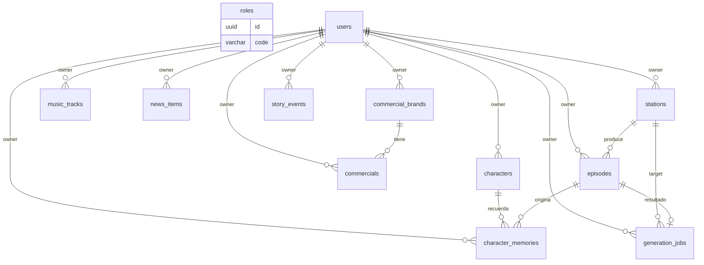

# 📚 Documentación Base de Datos — VirtualRadio

## Generador automatizado de estaciones de radio satíricas para simuladores. La base de datos almacena los usuarios, su universo narrativo compartido (noticias, comerciales, personajes y memoria), la biblioteca musical, las estaciones, los episodios generados y el estado de los jobs de generación.

---

## 📋 Información General

### Componentes de Datos

- **Base de datos principal**: PostgreSQL 18.5 — persistencia transaccional de todo el dominio (usuarios, universo narrativo, episodios, jobs).
- **Bases de datos auxiliares**: N/A.
- **Cache / Search / Otros**: Redis 8 — broker y result backend de Celery y cache de respuestas del LLM. El audio binario (música, voces, episodios MP3) **no** se guarda en la base de datos ni en Redis, sino en un volumen de archivos; la BD almacena únicamente sus rutas. Para la síntesis de voz (Gemini TTS), el **binario vive en el volumen** y Redis guarda solo el **índice** `tts:{hash} → ruta`.

> Alcance del documento: cubre el esquema relacional de PostgreSQL (tablas, enums, índices, constraints y relaciones). No cubre el almacenamiento de archivos de media ni la configuración de Redis.

---

### PostgreSQL (base de datos relacional)

- **Motor**: PostgreSQL 18.5
- **Encoding**: UTF-8
- **Host**: `db` (servicio Docker)
- **Puerto**: 5432
- **Usuario**: `virtualradio`
- **Schema**: `public`
- **Estrategia de IDs**: `UUID` (UUIDv7 nativo) en **todas** las tablas, generado por defecto con la función `uuidv7()` de PostgreSQL 18. UUIDv7 incorpora una marca temporal, por lo que las claves son ordenables por tiempo de inserción (buena localidad en índices B-tree).

**Nombre de base de datos**:

- `virtualradio` (local y producción; instancia única, aislamiento de datos a nivel de fila por `owner_id`)

---

### Otras Bases de Datos / Servicios

#### Redis

- **Motor**: Redis 8
- **Uso**: Broker y result backend de Celery; cache de respuestas del LLM e índice de voces Gemini TTS (el binario vive en el volumen de media)
- **Colecciones / Índices clave**:
  - `celery` (cola de tareas de generación)
  - `tts:{hash}` (índice de voces sintetizadas: hash de texto+rol → ruta en el volumen)
  - `job:{uuid}` (resultado/estado efímero de Celery, espejo de `generation_jobs`)

---

## 🎯 Propósito del Modelo de Datos

Dominios que cubre la base de datos:

- ✅ Identidad y propiedad de datos (usuarios, ownership)
- ✅ Configuración de estaciones de radio
- ✅ Biblioteca musical (indexación de MP3 y metadatos)
- ✅ Biblioteca compartida de noticias
- ✅ Biblioteca compartida de comerciales y marcas
- ✅ Sistema de personajes y memoria narrativa
- ✅ Eventos narrativos (story events) y running gags
- ✅ Episodios generados (guion JSON + audio exportado)
- ✅ Estado de los jobs de generación asíncrona

---

## 📊 Estadísticas Generales

```
Total de Tablas: 12
Total de Enums: 4
Total de Índices: 23
Total de Relaciones (FK): 16
```

---

## 🗂️ Estructura de Base de Datos

### Fuente de Verdad del Esquema

- **ORM / DDL**: Modelos SQLAlchemy 2.x en `backend/app/models/`
- **Migraciones**: Alembic / Flask-Migrate en `backend/migrations/`
- **Seeds**: `backend/app/seeds/` (estaciones, marcas, comerciales, personajes y noticias por defecto, asociados al usuario creado en el alta)

> Convención general: todas las tablas usan `id UUID PRIMARY KEY DEFAULT uuidv7()` (UUIDv7 nativo de PostgreSQL 18) e incluyen `created_at` y `updated_at` (`TIMESTAMPTZ`). Las tablas de datos del usuario incluyen `owner_id UUID NOT NULL` con FK a `users(id)` y borrado en cascada.

---

## 🔐 Identidad y Acceso

### 1. users

**Descripción**: Cuentas de usuario. Cada usuario es dueño de su propio universo de datos; el aislamiento se aplica por `owner_id` en el resto de tablas.

```sql
CREATE TABLE users (
    id UUID PRIMARY KEY DEFAULT uuidv7(),
    email VARCHAR(255) NOT NULL,
    password_hash VARCHAR(255) NOT NULL,
    display_name VARCHAR(120),
    is_active BOOLEAN NOT NULL DEFAULT true,
    created_at TIMESTAMPTZ NOT NULL DEFAULT now(),
    updated_at TIMESTAMPTZ NOT NULL DEFAULT now()
);
```

#### DDL de Índices y Constraints

```sql
CREATE UNIQUE INDEX uq_users_email ON users(lower(email));
```

#### Diccionario de Campos

| Campo | Tipo | Descripción |
| --------- | -------- | ------------------ |
| id | UUID | Identificador único del usuario |
| email | VARCHAR(255) | Correo de acceso (único, case-insensitive) |
| password_hash | VARCHAR(255) | Hash de la contraseña (bcrypt/argon2) |
| display_name | VARCHAR(120) | Nombre visible |
| is_active | BOOLEAN | Habilita/inhabilita el login |
| created_at | TIMESTAMPTZ | Fecha de alta |
| updated_at | TIMESTAMPTZ | Última modificación |

#### Reglas de Negocio

- El email es único e identifica al usuario en el login.
- Nunca se almacena la contraseña en claro.
- Al darse de alta, se siembran datos por defecto (estaciones, marcas, comerciales, personajes y noticias) asociados a su `id`.

---

### 12. roles

**Descripción**: Catálogo de roles del sistema (RBAC). En esta versión el rol es único y constante (`USER`); la tabla se mantiene como catálogo y referencia. La asignación de rol al usuario es **implícita** (`USER` por defecto): no se modela una relación configurable `users` ↔ `roles`. Ver `docs/backend/rbac.md`.

```sql
CREATE TABLE roles (
    id UUID PRIMARY KEY DEFAULT uuidv7(),
    code VARCHAR(50) NOT NULL,
    name VARCHAR(100) NOT NULL,
    description TEXT,
    is_system_role BOOLEAN NOT NULL DEFAULT false,
    permissions JSONB NOT NULL DEFAULT '[]',
    created_at TIMESTAMPTZ NOT NULL DEFAULT now(),
    updated_at TIMESTAMPTZ NOT NULL DEFAULT now()
);
```

#### DDL de Índices y Constraints

```sql
CREATE UNIQUE INDEX uq_roles_code ON roles(code);
```

#### Diccionario de Campos

| Campo | Tipo | Descripción |
| --------- | -------- | ------------------ |
| id | UUID | Identificador del rol |
| code | VARCHAR(50) | Código único del rol (ej. `USER`, `SUPER_ADMIN`) |
| name | VARCHAR(100) | Nombre visible |
| description | TEXT | Descripción del rol |
| is_system_role | BOOLEAN | Marca rol de sistema |
| permissions | JSONB | Lista de permisos `resource:action:scope` |
| created_at | TIMESTAMPTZ | Fecha de creación |
| updated_at | TIMESTAMPTZ | Última modificación |

#### Reglas de Negocio

- En v1.0 solo se siembra el rol `USER`; `SUPER_ADMIN` se documenta como referencia y no se asigna a ningún usuario.
- La tabla no lleva `owner_id`: es un catálogo global, no datos de usuario.

---

## 📻 Estaciones y Episodios

### 2. stations

**Descripción**: Perfiles de estaciones de radio configurables por el usuario (nombre, locutor, personalidad, plantillas de intro/outro).

```sql
CREATE TABLE stations (
    id UUID PRIMARY KEY DEFAULT uuidv7(),
    owner_id UUID NOT NULL,
    name VARCHAR(120) NOT NULL,
    host_name VARCHAR(120),
    description TEXT,
    personality TEXT,
    frequency VARCHAR(20),
    emoji VARCHAR(16),
    color VARCHAR(9),
    intro_templates JSONB NOT NULL DEFAULT '[]',
    outro_templates JSONB NOT NULL DEFAULT '[]',
    created_at TIMESTAMPTZ NOT NULL DEFAULT now(),
    updated_at TIMESTAMPTZ NOT NULL DEFAULT now()
);
```

#### DDL de Índices y Constraints

```sql
CREATE INDEX ix_stations_owner ON stations(owner_id);
CREATE UNIQUE INDEX uq_stations_owner_name ON stations(owner_id, name);

ALTER TABLE stations ADD CONSTRAINT fk_stations_owner
    FOREIGN KEY (owner_id) REFERENCES users(id) ON DELETE CASCADE;
```

#### Diccionario de Campos

| Campo | Tipo | Descripción |
| --------- | -------- | ------------------ |
| id | UUID | Identificador de la estación |
| owner_id | UUID | Propietario (FK → users) |
| name | VARCHAR(120) | Nombre de la estación (único por usuario) |
| host_name | VARCHAR(120) | Nombre del locutor principal |
| description | TEXT | Descripción del formato/estilo |
| personality | TEXT | Rasgos de personalidad del locutor |
| frequency | VARCHAR(20) | Frecuencia ficticia (ej. "99.1 FM") |
| emoji | VARCHAR(16) | Icono representativo |
| color | VARCHAR(9) | Color de acento (hex) |
| intro_templates | JSONB | Lista de frases de introducción |
| outro_templates | JSONB | Lista de frases de cierre |
| created_at | TIMESTAMPTZ | Fecha de creación |
| updated_at | TIMESTAMPTZ | Última modificación |

#### Reglas de Negocio

- El nombre de la estación es único dentro del ámbito de cada usuario.
- Estaciones iniciales sugeridas: AgroTalk FM, Trucker News Radio, SimNation News, WCTR Sim Edition, Radio Rural 24, Highway Talk Network y Custom.

---

### 3. episodes

**Descripción**: Episodios generados. Almacena el guion estructurado (JSON) y la ruta del MP3 final exportado.

```sql
CREATE TABLE episodes (
    id UUID PRIMARY KEY DEFAULT uuidv7(),
    owner_id UUID NOT NULL,
    station_id UUID NOT NULL,
    title VARCHAR(200) NOT NULL,
    duration REAL NOT NULL DEFAULT 0,
    script_json JSONB NOT NULL DEFAULT '[]',
    audio_path VARCHAR(500),
    created_at TIMESTAMPTZ NOT NULL DEFAULT now(),
    updated_at TIMESTAMPTZ NOT NULL DEFAULT now()
);
```

#### DDL de Índices y Constraints

```sql
CREATE INDEX ix_episodes_owner ON episodes(owner_id);
CREATE INDEX ix_episodes_station ON episodes(station_id);

ALTER TABLE episodes ADD CONSTRAINT fk_episodes_owner
    FOREIGN KEY (owner_id) REFERENCES users(id) ON DELETE CASCADE;
ALTER TABLE episodes ADD CONSTRAINT fk_episodes_station
    FOREIGN KEY (station_id) REFERENCES stations(id) ON DELETE CASCADE;
```

#### Diccionario de Campos

| Campo | Tipo | Descripción |
| --------- | -------- | ------------------ |
| id | UUID | Identificador del episodio |
| owner_id | UUID | Propietario (FK → users) |
| station_id | UUID | Estación de origen (FK → stations) |
| title | VARCHAR(200) | Título del episodio |
| duration | REAL | Duración total en segundos (0 hasta compilar) |
| script_json | JSONB | Lista de segmentos del guion (speech/music/fx) |
| audio_path | VARCHAR(500) | Ruta relativa del MP3 exportado |
| created_at | TIMESTAMPTZ | Fecha de generación |
| updated_at | TIMESTAMPTZ | Última modificación |

#### Reglas de Negocio

- `script_json` contiene segmentos con forma `{type, speaker, text, voice_id, effect, track_id, duration_seconds}`.
- Al eliminar un episodio debe borrarse también su archivo MP3 del volumen de media.
- `duration` y `audio_path` se completan cuando el worker termina la compilación.

---

## 🎵 Biblioteca Musical

### 4. music_tracks

**Descripción**: Índice de pistas musicales escaneadas o subidas por el usuario, con metadatos y hash anti-duplicados.

```sql
CREATE TABLE music_tracks (
    id UUID PRIMARY KEY DEFAULT uuidv7(),
    owner_id UUID NOT NULL,
    file_path VARCHAR(700) NOT NULL,
    title VARCHAR(255),
    artist VARCHAR(255),
    album VARCHAR(255),
    duration REAL,
    file_hash CHAR(32) NOT NULL,
    created_at TIMESTAMPTZ NOT NULL DEFAULT now(),
    updated_at TIMESTAMPTZ NOT NULL DEFAULT now()
);
```

#### DDL de Índices y Constraints

```sql
CREATE INDEX ix_music_owner ON music_tracks(owner_id);
CREATE UNIQUE INDEX uq_music_owner_hash ON music_tracks(owner_id, file_hash);
CREATE UNIQUE INDEX uq_music_owner_path ON music_tracks(owner_id, file_path);

ALTER TABLE music_tracks ADD CONSTRAINT fk_music_owner
    FOREIGN KEY (owner_id) REFERENCES users(id) ON DELETE CASCADE;
```

#### Diccionario de Campos

| Campo | Tipo | Descripción |
| --------- | -------- | ------------------ |
| id | UUID | Identificador de la pista |
| owner_id | UUID | Propietario (FK → users) |
| file_path | VARCHAR(700) | Ruta del archivo MP3 |
| title | VARCHAR(255) | Título (metadato) |
| artist | VARCHAR(255) | Artista (metadato) |
| album | VARCHAR(255) | Álbum (metadato) |
| duration | REAL | Duración en segundos |
| file_hash | CHAR(32) | MD5 del archivo (previene duplicados) |
| created_at | TIMESTAMPTZ | Fecha de indexación |
| updated_at | TIMESTAMPTZ | Última modificación |

#### Reglas de Negocio

- El hash MD5 evita indexar el mismo archivo dos veces para un usuario.
- El escaneo sincroniza altas y bajas entre el sistema de archivos y la BD.

---

## 📰 Biblioteca Compartida de Noticias

### 5. news_items

**Descripción**: Noticias ficticias reutilizables por múltiples estaciones del usuario; contenido independiente del episodio para crear sensación de mundo compartido.

```sql
CREATE TYPE news_category AS ENUM (
    'Agricultura', 'Transporte', 'Economía', 'Tecnología',
    'Clima', 'Comunidad', 'Política Local', 'Sucesos Extraños'
);

CREATE TYPE news_tone AS ENUM (
    'Serio', 'Sensacionalista', 'Misterioso', 'Absurdo'
);

CREATE TABLE news_items (
    id UUID PRIMARY KEY DEFAULT uuidv7(),
    owner_id UUID NOT NULL,
    headline VARCHAR(300) NOT NULL,
    summary TEXT,
    full_script TEXT,
    category news_category NOT NULL,
    tone news_tone NOT NULL,
    is_active BOOLEAN NOT NULL DEFAULT true,
    expires_at TIMESTAMPTZ,
    created_at TIMESTAMPTZ NOT NULL DEFAULT now(),
    updated_at TIMESTAMPTZ NOT NULL DEFAULT now()
);
```

#### DDL de Índices y Constraints

```sql
CREATE INDEX ix_news_owner ON news_items(owner_id);
CREATE INDEX ix_news_active ON news_items(owner_id, is_active);

ALTER TABLE news_items ADD CONSTRAINT fk_news_owner
    FOREIGN KEY (owner_id) REFERENCES users(id) ON DELETE CASCADE;
```

#### Enums Relacionados

##### news_category

| Valor | Descripción |
| --------- | ------------------------- |
| Agricultura | Noticias del mundo agrícola |
| Transporte | Transporte y logística |
| Economía | Mercados y precios |
| Tecnología | Maquinaria y tecnología |
| Clima | Reportes meteorológicos |
| Comunidad | Eventos y vida local |
| Política Local | Regulaciones y política |
| Sucesos Extraños | Noticias absurdas / conspirativas |

##### news_tone

| Valor | Descripción |
| --------- | ------------------------- |
| Serio | Tono informativo formal |
| Sensacionalista | Alto nivel de dramatismo |
| Misterioso | Enfoque enigmático |
| Absurdo | Tono satírico/cómico |

#### Diccionario de Campos

| Campo | Tipo | Descripción |
| --------- | -------- | ------------------ |
| id | UUID | Identificador de la noticia |
| owner_id | UUID | Propietario (FK → users) |
| headline | VARCHAR(300) | Titular |
| summary | TEXT | Resumen breve |
| full_script | TEXT | Guion de lectura (3-5 frases) |
| category | news_category | Categoría temática |
| tone | news_tone | Tono narrativo |
| is_active | BOOLEAN | Disponible para selección |
| expires_at | TIMESTAMPTZ | Fecha de archivado/caducidad |
| created_at | TIMESTAMPTZ | Fecha de creación |
| updated_at | TIMESTAMPTZ | Última modificación |

#### Reglas de Negocio

- Una noticia puede aparecer en varios episodios y estaciones del usuario.
- Las noticias caducadas (`expires_at` pasado) se archivan (`is_active = false`).

---

## 📢 Biblioteca Compartida de Comerciales

### 6. commercial_brands

**Descripción**: Marcas ficticias del universo compartido (ej. AgroFuel, MegaHaul Logistics, FarmNet, TractorCoin).

```sql
CREATE TABLE commercial_brands (
    id UUID PRIMARY KEY DEFAULT uuidv7(),
    owner_id UUID NOT NULL,
    name VARCHAR(150) NOT NULL,
    description TEXT,
    industry VARCHAR(100),
    slogan VARCHAR(255),
    is_active BOOLEAN NOT NULL DEFAULT true,
    created_at TIMESTAMPTZ NOT NULL DEFAULT now(),
    updated_at TIMESTAMPTZ NOT NULL DEFAULT now()
);
```

#### DDL de Índices y Constraints

```sql
CREATE INDEX ix_brands_owner ON commercial_brands(owner_id);
CREATE UNIQUE INDEX uq_brands_owner_name ON commercial_brands(owner_id, name);

ALTER TABLE commercial_brands ADD CONSTRAINT fk_brands_owner
    FOREIGN KEY (owner_id) REFERENCES users(id) ON DELETE CASCADE;
```

#### Diccionario de Campos

| Campo | Tipo | Descripción |
| --------- | -------- | ------------------ |
| id | UUID | Identificador de la marca |
| owner_id | UUID | Propietario (FK → users) |
| name | VARCHAR(150) | Nombre de la marca (único por usuario) |
| description | TEXT | Descripción de la marca |
| industry | VARCHAR(100) | Sector (Agricultura, Transporte, etc.) |
| slogan | VARCHAR(255) | Eslogan |
| is_active | BOOLEAN | Marca activa |
| created_at | TIMESTAMPTZ | Fecha de creación |
| updated_at | TIMESTAMPTZ | Última modificación |

#### Reglas de Negocio

- Las marcas pertenecen al universo compartido del usuario y se reutilizan entre episodios.

---

### 7. commercials

**Descripción**: Anuncios concretos de una marca; pueden tener variantes y campañas.

```sql
CREATE TABLE commercials (
    id UUID PRIMARY KEY DEFAULT uuidv7(),
    owner_id UUID NOT NULL,
    brand_id UUID NOT NULL,
    title VARCHAR(200) NOT NULL,
    script TEXT NOT NULL,
    duration REAL NOT NULL DEFAULT 30,
    campaign VARCHAR(150),
    is_active BOOLEAN NOT NULL DEFAULT true,
    created_at TIMESTAMPTZ NOT NULL DEFAULT now(),
    updated_at TIMESTAMPTZ NOT NULL DEFAULT now()
);
```

#### DDL de Índices y Constraints

```sql
CREATE INDEX ix_commercials_owner ON commercials(owner_id);
CREATE INDEX ix_commercials_brand ON commercials(brand_id);

ALTER TABLE commercials ADD CONSTRAINT fk_commercials_owner
    FOREIGN KEY (owner_id) REFERENCES users(id) ON DELETE CASCADE;
ALTER TABLE commercials ADD CONSTRAINT fk_commercials_brand
    FOREIGN KEY (brand_id) REFERENCES commercial_brands(id) ON DELETE CASCADE;
```

#### Diccionario de Campos

| Campo | Tipo | Descripción |
| --------- | -------- | ------------------ |
| id | UUID | Identificador del comercial |
| owner_id | UUID | Propietario (FK → users) |
| brand_id | UUID | Marca asociada (FK → commercial_brands) |
| title | VARCHAR(200) | Título del anuncio |
| script | TEXT | Guion del comercial (3-5 frases) |
| duration | REAL | Duración estimada en segundos |
| campaign | VARCHAR(150) | Campaña a la que pertenece |
| is_active | BOOLEAN | Comercial activo |
| created_at | TIMESTAMPTZ | Fecha de creación |
| updated_at | TIMESTAMPTZ | Última modificación |

#### Reglas de Negocio

- Cada comercial pertenece a exactamente una marca.
- Los anuncios pueden repetirse y evolucionar mediante campañas.

---

## 👥 Sistema de Personajes y Memoria Narrativa

### 8. characters

**Descripción**: Personajes recurrentes (oyentes que llaman, reporteros, etc.) con personalidad y afinidad de estación.

```sql
CREATE TABLE characters (
    id UUID PRIMARY KEY DEFAULT uuidv7(),
    owner_id UUID NOT NULL,
    name VARCHAR(150) NOT NULL,
    role VARCHAR(150),
    description TEXT,
    personality TEXT,
    station_affinity TEXT,
    first_appearance TIMESTAMPTZ NOT NULL DEFAULT now(),
    last_appearance TIMESTAMPTZ NOT NULL DEFAULT now(),
    created_at TIMESTAMPTZ NOT NULL DEFAULT now(),
    updated_at TIMESTAMPTZ NOT NULL DEFAULT now()
);
```

#### DDL de Índices y Constraints

```sql
CREATE INDEX ix_characters_owner ON characters(owner_id);
CREATE UNIQUE INDEX uq_characters_owner_name ON characters(owner_id, name);

ALTER TABLE characters ADD CONSTRAINT fk_characters_owner
    FOREIGN KEY (owner_id) REFERENCES users(id) ON DELETE CASCADE;
```

#### Diccionario de Campos

| Campo | Tipo | Descripción |
| --------- | -------- | ------------------ |
| id | UUID | Identificador del personaje |
| owner_id | UUID | Propietario (FK → users) |
| name | VARCHAR(150) | Nombre (único por usuario) |
| role | VARCHAR(150) | Rol/oficio (ej. "Granjero jubilado") |
| description | TEXT | Quién es y por qué llama |
| personality | TEXT | Rasgos de habla y carácter |
| station_affinity | TEXT | Estaciones que escucha (lista separada por comas) |
| first_appearance | TIMESTAMPTZ | Primera aparición |
| last_appearance | TIMESTAMPTZ | Última aparición |
| created_at | TIMESTAMPTZ | Fecha de creación |
| updated_at | TIMESTAMPTZ | Última modificación |

#### Reglas de Negocio

- `last_appearance` se actualiza cada vez que el personaje participa en un episodio.

---

### 9. character_memories

**Descripción**: Memoria narrativa por personaje; registra eventos pasados para mantener continuidad y running gags.

```sql
CREATE TABLE character_memories (
    id UUID PRIMARY KEY DEFAULT uuidv7(),
    owner_id UUID NOT NULL,
    character_id UUID NOT NULL,
    episode_id UUID,
    memory TEXT NOT NULL,
    importance SMALLINT NOT NULL DEFAULT 5,
    created_at TIMESTAMPTZ NOT NULL DEFAULT now(),
    updated_at TIMESTAMPTZ NOT NULL DEFAULT now()
);
```

#### DDL de Índices y Constraints

```sql
CREATE INDEX ix_memories_character ON character_memories(character_id);
CREATE INDEX ix_memories_owner ON character_memories(owner_id);

ALTER TABLE character_memories ADD CONSTRAINT fk_memories_owner
    FOREIGN KEY (owner_id) REFERENCES users(id) ON DELETE CASCADE;
ALTER TABLE character_memories ADD CONSTRAINT fk_memories_character
    FOREIGN KEY (character_id) REFERENCES characters(id) ON DELETE CASCADE;
ALTER TABLE character_memories ADD CONSTRAINT fk_memories_episode
    FOREIGN KEY (episode_id) REFERENCES episodes(id) ON DELETE SET NULL;
ALTER TABLE character_memories ADD CONSTRAINT ck_memories_importance
    CHECK (importance BETWEEN 1 AND 10);
```

#### Diccionario de Campos

| Campo | Tipo | Descripción |
| --------- | -------- | ------------------ |
| id | UUID | Identificador de la memoria |
| owner_id | UUID | Propietario (FK → users) |
| character_id | UUID | Personaje (FK → characters) |
| episode_id | UUID | Episodio que generó la memoria (FK → episodes, nullable) |
| memory | TEXT | Hecho narrativo recordado |
| importance | SMALLINT | Relevancia (1-10) |
| created_at | TIMESTAMPTZ | Fecha de creación |
| updated_at | TIMESTAMPTZ | Última modificación |

#### Reglas de Negocio

- Si se elimina el episodio asociado, la memoria se conserva (`episode_id` → NULL).
- Las memorias de mayor `importance` tienen prioridad al construir el contexto del LLM.

---

### 10. story_events

**Descripción**: Arcos narrativos del universo (eventos que evolucionan entre episodios y enlazan personajes).

```sql
CREATE TYPE story_status AS ENUM ('active', 'resolved');

CREATE TABLE story_events (
    id UUID PRIMARY KEY DEFAULT uuidv7(),
    owner_id UUID NOT NULL,
    title VARCHAR(200) NOT NULL,
    description TEXT,
    related_characters TEXT,
    status story_status NOT NULL DEFAULT 'active',
    resolved_at TIMESTAMPTZ,
    created_at TIMESTAMPTZ NOT NULL DEFAULT now(),
    updated_at TIMESTAMPTZ NOT NULL DEFAULT now()
);
```

#### DDL de Índices y Constraints

```sql
CREATE INDEX ix_events_owner ON story_events(owner_id);
CREATE INDEX ix_events_status ON story_events(owner_id, status);

ALTER TABLE story_events ADD CONSTRAINT fk_events_owner
    FOREIGN KEY (owner_id) REFERENCES users(id) ON DELETE CASCADE;
```

#### Enums Relacionados

##### story_status

| Valor | Descripción |
| --------- | ------------------------- |
| active | Arco narrativo en curso |
| resolved | Arco narrativo cerrado |

#### Diccionario de Campos

| Campo | Tipo | Descripción |
| --------- | -------- | ------------------ |
| id | UUID | Identificador del evento |
| owner_id | UUID | Propietario (FK → users) |
| title | VARCHAR(200) | Título del arco |
| description | TEXT | Descripción del evento |
| related_characters | TEXT | Personajes implicados (lista) |
| status | story_status | Estado del arco |
| resolved_at | TIMESTAMPTZ | Fecha de resolución |
| created_at | TIMESTAMPTZ | Fecha de creación |
| updated_at | TIMESTAMPTZ | Última modificación |

#### Reglas de Negocio

- Un evento se marca `resolved` y se sella `resolved_at` cuando concluye su arco narrativo.

---

## ⚙️ Generación Asíncrona

### 11. generation_jobs

**Descripción**: Estado persistente de los jobs de generación de episodios ejecutados por Celery (reemplaza el dict en memoria del prototipo).

```sql
CREATE TYPE job_status AS ENUM (
    'queued', 'planning', 'synthesizing', 'mixing', 'completed', 'failed'
);

CREATE TABLE generation_jobs (
    id UUID PRIMARY KEY DEFAULT uuidv7(),
    owner_id UUID NOT NULL,
    station_id UUID NOT NULL,
    episode_id UUID,
    status job_status NOT NULL DEFAULT 'queued',
    progress SMALLINT NOT NULL DEFAULT 0,
    error TEXT,
    created_at TIMESTAMPTZ NOT NULL DEFAULT now(),
    updated_at TIMESTAMPTZ NOT NULL DEFAULT now()
);
```

#### DDL de Índices y Constraints

```sql
CREATE INDEX ix_jobs_owner ON generation_jobs(owner_id);
CREATE INDEX ix_jobs_status ON generation_jobs(owner_id, status);

ALTER TABLE generation_jobs ADD CONSTRAINT fk_jobs_owner
    FOREIGN KEY (owner_id) REFERENCES users(id) ON DELETE CASCADE;
ALTER TABLE generation_jobs ADD CONSTRAINT fk_jobs_station
    FOREIGN KEY (station_id) REFERENCES stations(id) ON DELETE CASCADE;
ALTER TABLE generation_jobs ADD CONSTRAINT fk_jobs_episode
    FOREIGN KEY (episode_id) REFERENCES episodes(id) ON DELETE SET NULL;
```

#### Enums Relacionados

##### job_status

| Valor | Descripción |
| --------- | ------------------------- |
| queued | Encolado, pendiente de ejecución |
| planning | Episode Planner generando la estructura/guion |
| synthesizing | Síntesis de voces (TTS) en curso |
| mixing | Mezcla de audio y efectos en curso |
| completed | Episodio generado correctamente |
| failed | Error durante la generación (ver `error`) |

#### Diccionario de Campos

| Campo | Tipo | Descripción |
| --------- | -------- | ------------------ |
| id | UUID | Identificador del job (devuelto al cliente para polling) |
| owner_id | UUID | Propietario (FK → users) |
| station_id | UUID | Estación objetivo (FK → stations) |
| episode_id | UUID | Episodio resultante (FK → episodes, nullable) |
| status | job_status | Estado actual del pipeline |
| progress | SMALLINT | Porcentaje de avance (0-100) |
| error | TEXT | Mensaje de error si `status = failed` |
| created_at | TIMESTAMPTZ | Fecha de encolado |
| updated_at | TIMESTAMPTZ | Última actualización de estado |

#### Reglas de Negocio

- El cliente consulta `GET /api/v1/jobs/{id}` para seguir el progreso.
- El estado sobrevive a reinicios del worker (a diferencia del prototipo basado en memoria).

---

## 🧩 Relaciones Entre Tablas

> `roles` es un catálogo global sin claves foráneas (la asignación de rol es implícita), por lo que aparece como entidad aislada.



---

## 📈 Métricas y Crecimiento

| Tabla | Registros/día | Retención | Tamaño estimado | Crecimiento anual |
| --------- | ------------- | --------- | --------------- | ----------------- |
| roles | N/A (catálogo) | Permanente | < 1 KB | Nulo |
| users | Bajo | Permanente | < 1 MB | Lineal con altas |
| stations | Bajo | Permanente | < 1 MB | Estable |
| episodes | Medio (por generación) | Permanente / archivable | Medio (JSON + ruta) | Alto |
| music_tracks | Variable (escaneos) | Permanente | Bajo (solo metadatos) | Medio |
| news_items | Bajo-Medio | Archivable (`expires_at`) | Bajo | Medio |
| commercial_brands | Bajo | Permanente | Bajo | Estable |
| commercials | Bajo-Medio | Permanente | Bajo | Medio |
| characters | Bajo | Permanente | Bajo | Estable |
| character_memories | Medio (por episodio) | Permanente | Bajo | Alto |
| story_events | Bajo | Permanente | Bajo | Bajo |
| generation_jobs | Medio (por generación) | Corta (limpieza) | Bajo | Medio |

---

## 🚀 Operación y Mantenimiento

### Migraciones

- Gestionadas con Alembic / Flask-Migrate (`flask db migrate` / `flask db upgrade`). Una migración por cambio de esquema, versionada en `backend/migrations/`.

### Retención / Limpieza

- `generation_jobs` en estado `completed`/`failed` se purgan periódicamente (tarea Celery programada / Celery Beat) tras N días.
- `news_items` con `expires_at` vencido se marcan `is_active = false` (archivado lógico) mediante una tarea Celery programada (Celery Beat) que se ejecuta a diario, análoga a la limpieza de `generation_jobs`.
- Al borrar un episodio se elimina su MP3 del volumen de media.

### Consideraciones de Performance

- Índices por `owner_id` en todas las tablas (filtro obligatorio por propietario en cada query).
- Índices compuestos `(owner_id, status)` para listados de jobs y noticias activas.
- Índices únicos sobre `file_hash` y `email` para integridad y deduplicación.

---

## 📌 Notas y Decisiones de Diseño

- **Aislamiento por fila (`owner_id`)** en lugar de multi-tenant físico: simple y suficiente para un único rol `USER` con scope `own` (ver `docs/backend/rbac.md`).
- **JSONB** para `script_json`, `intro_templates` y `outro_templates`: estructuras flexibles que no requieren normalización adicional.
- **Enums Postgres** en lugar de texto libre (categorías/tonos/estados) para integridad y consistencia frente al prototipo SQLite.
- **UUIDv7 nativo** (`uuidv7()` de PostgreSQL 18) como estrategia única de IDs: identificadores opacos para el cliente (no filtran volumen ni secuencia) y, a la vez, ordenables por tiempo de creación, lo que preserva la localidad en índices B-tree y reduce la fragmentación frente a UUIDv4 aleatorio.
- El audio binario vive en disco (volumen), no en la BD; la base solo guarda rutas y metadatos, manteniendo la base ligera.
