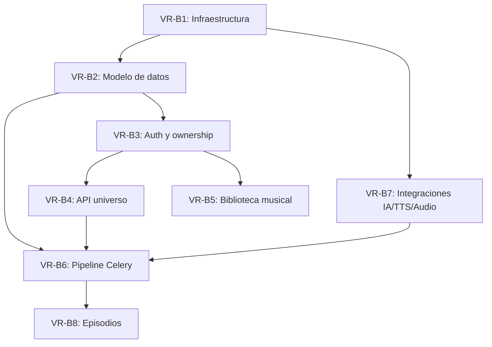

# Plan de Implementación - VirtualRadio Backend
## VirtualRadio v1.0 - API REST y pipeline de generación de radio

**Versión:** 1.0
**Fecha:** Junio 2026
**Total de Historias:** 8
**Total de Tareas:** 24
**Story Points Estimados:** 110 SP

---

## Tabla de Contenidos

1. [Resumen Ejecutivo](#resumen-ejecutivo)
2. [Estructura del Plan](#estructura-del-plan)
3. [Historias de Usuario](#historias-de-usuario)
4. [Resumen de Estimación](#resumen-de-estimación)
5. [Orden de Implementación Recomendado](#orden-de-implementación-recomendado)
6. [Dependencias Críticas](#dependencias-críticas)
7. [Riesgos y Mitigaciones](#riesgos-y-mitigaciones)
8. [Métricas de Éxito](#métricas-de-éxito)
9. [Notas Finales](#notas-finales)

---

## Resumen Ejecutivo

VirtualRadio Backend es la API y el motor de generación de una plataforma que produce, de forma automatizada, programas de radio satíricos para videojuegos de simulación. Resuelve el problema de crear contenido de audio inmersivo y reutilizable (locutor, noticias, comerciales, llamadas y música) sin trabajo manual, manteniendo un universo narrativo coherente y persistente por usuario. El presente plan describe la construcción del backend **desde cero** sobre el stack final (Flask + SQLAlchemy + PostgreSQL + Redis/Celery + Docker), tomando el prototipo como referencia funcional.

### Características Clave
- **API REST autenticada**: gestión del universo (estaciones, noticias, comerciales, personajes, música) con aislamiento de datos por usuario.
- **Pipeline de generación por agentes**: Episode Planner, News, Commercial, Character, Host y Assembly producen el guion JSON del episodio.
- **Generación asíncrona**: el pipeline (guion → voces → mezcla → exportación) corre en Celery con seguimiento de estado.
- **Biblioteca compartida reutilizable**: noticias, comerciales y personajes con memoria narrativa para reducir costos de LLM y crear continuidad.
- **Producción de audio**: síntesis de voz (TTS), ducking, telefonía, FX y exportación a MP3 con FFmpeg/pydub.

### Stack Tecnológico
- **Runtime**: Python 3.12, Gunicorn, Celery worker
- **Framework**: Flask 3 (application factory + Blueprints)
- **Database**: PostgreSQL 18.5 (SQLAlchemy 2.x + Alembic; IDs en UUIDv7 nativo)
- **Cache**: Redis 8 (broker/result backend Celery + índice de voces Gemini TTS; el binario vive en el volumen)
- **IA / Audio**: OpenRouter/Gemini (LLM), Gemini TTS, FFmpeg + pydub
- **Process Manager**: Docker / docker-compose

---

## Estructura del Plan

Este plan está organizado en **8 Historias de Usuario** principales, cada una con múltiples **Tareas Técnicas** detalladas.

| Historia | Nombre | Story Points | Tareas | Prioridad |
|----------|--------|--------------|--------|-----------|
| **VR-B1** | Infraestructura y contenedores | 13 SP | 3 | Highest |
| **VR-B2** | Modelo de datos y migraciones | 13 SP | 3 | Highest |
| **VR-B3** | Autenticación JWT y ownership | 13 SP | 3 | Highest |
| **VR-B4** | API del universo narrativo (CRUD) | 21 SP | 4 | High |
| **VR-B5** | Biblioteca musical | 8 SP | 2 | High |
| **VR-B6** | Pipeline de generación con Celery | 21 SP | 4 | High |
| **VR-B7** | Integraciones IA, TTS y motor de audio | 13 SP | 3 | Medium |
| **VR-B8** | Gestión y exportación de episodios | 8 SP | 2 | Medium |

---

## Historias de Usuario

---

## VR-B1: Infraestructura y contenedores

**Tipo**: Story
**Prioridad**: Highest
**Story Points**: 13 SP

**Como** desarrollador del equipo
**Quiero** un entorno Dockerizado con todos los servicios del backend
**Para** levantar y desplegar la API, el worker, la base de datos y Redis de forma reproducible

**Descripción**:
Se construye el esqueleto del proyecto Flask (application factory + Blueprints) y la orquestación Docker con los servicios `api`, `worker`, `db` (PostgreSQL) y `redis`, además de los volúmenes de media y datos. Es la base sobre la que se apoyan el resto de historias.

**Criterios de Aceptación**:
- ✅ `docker-compose up` levanta api, worker, db y redis sin errores
- ✅ La API responde en un endpoint de healthcheck
- ✅ FFmpeg disponible en las imágenes de api y worker
- ✅ Variables de entorno y secretos gestionados por `.env` / variables del entorno

**Tareas Técnicas**:

---

### VR-B1.1: Scaffolding del proyecto Flask
**Tipo**: Task
**Story Points**: 5 SP

**Subtareas**:
- [ ] Crear estructura `app/` (routes, controllers, services, repositories, models, integrations, schemas, tasks, config)
- [ ] Implementar `create_app()` (application factory) y `extensions.py` (db, migrate, jwt, celery)
- [ ] Configurar `wsgi.py`, `celery_worker.py` y `requirements.txt`
- [ ] Endpoint `GET /api/v1/health`

**Dependencias**: —

---

### VR-B1.2: Dockerfiles y docker-compose
**Tipo**: Task
**Story Points**: 5 SP

**Subtareas**:
- [ ] `Dockerfile` del backend (con FFmpeg y dependencias de audio)
- [ ] `docker-compose.yml` con servicios api, worker, db, redis
  - Volúmenes para Postgres y media (`episodes/`, `music/`, `vox/`, `fx/`)
  - Healthchecks y `depends_on`
- [ ] Servicio worker arrancando Celery con la misma imagen

**Dependencias**: VR-B1.1

---

### VR-B1.3: Configuración por entorno y logging
**Tipo**: Task
**Story Points**: 3 SP

**Subtareas**:
- [ ] Clases de configuración (dev/test/prod) y carga de variables de entorno
- [ ] Logging estructurado (JSON) y CORS
- [ ] Plantilla `.env.example` (DB, Redis, JWT secret, OPENROUTER_API_KEY, GEMINI_API_KEY)

**Dependencias**: VR-B1.1

---

## VR-B2: Modelo de datos y migraciones

**Tipo**: Story
**Prioridad**: Highest
**Story Points**: 13 SP

**Como** desarrollador del equipo
**Quiero** los modelos SQLAlchemy y migraciones de todo el dominio
**Para** persistir usuarios, universo narrativo, episodios y jobs en PostgreSQL

**Descripción**:
Se modelan en SQLAlchemy todas las entidades descritas en `docs/backend/base-de-datos.md`, incluyendo `users`, `generation_jobs`, los enums Postgres y la columna `owner_id` en las tablas de datos del usuario. Se gestionan migraciones con Alembic y seeds por defecto.

**Criterios de Aceptación**:
- ✅ 12 tablas y 4 enums creados vía migración Alembic
- ✅ Todas las tablas de usuario incluyen `owner_id` con FK y cascada
- ✅ Índices únicos por `(owner_id, …)` y sobre `email`/`file_hash`
- ✅ Seeds idempotentes de estaciones, marcas, comerciales, personajes y noticias por usuario

**Tareas Técnicas**:

---

### VR-B2.1: Modelos SQLAlchemy y enums
**Tipo**: Task
**Story Points**: 5 SP

**Subtareas**:
- [ ] Modelos: `User`, `Role`, `Station`, `Episode`, `MusicTrack`, `NewsItem`, `CommercialBrand`, `Commercial`, `Character`, `CharacterMemory`, `StoryEvent`, `GenerationJob`
- [ ] Enums: `news_category`, `news_tone`, `story_status`, `job_status`
- [ ] Mixin de timestamps (`created_at`/`updated_at`) y mixin de ownership

**Dependencias**: VR-B1.1

---

### VR-B2.2: Migraciones Alembic
**Tipo**: Task
**Story Points**: 5 SP

**Subtareas**:
- [ ] Configurar Flask-Migrate/Alembic
- [ ] Migración inicial con tablas, enums, índices y constraints (FK, CHECK, UNIQUE)
- [ ] Verificar `flask db upgrade` en limpio

**Dependencias**: VR-B2.1

---

### VR-B2.3: Seeds y repositorios base
**Tipo**: Task
**Story Points**: 3 SP

**Subtareas**:
- [ ] Repositorio base con helper `scoped_query(model)` filtrando por `owner_id`
- [ ] Seed del catálogo de roles (`USER`; `SUPER_ADMIN` como referencia, sin asignar)
- [ ] Seeds por defecto asociados al usuario en el alta
- [ ] Datos de FX base (`static_hum`, `sweeper`) provisionados en el volumen

**Dependencias**: VR-B2.2

---

## VR-B3: Autenticación JWT y ownership

**Tipo**: Story
**Prioridad**: Highest
**Story Points**: 13 SP

**Como** usuario
**Quiero** registrarme e iniciar sesión
**Para** acceder de forma segura únicamente a mis propios datos

**Descripción**:
Se implementa el registro/login con JWT (Flask-JWT-Extended), hashing de contraseñas y el modelo de autorización de un único rol `USER` con scope `own` descrito en `docs/backend/rbac.md`. Se crea el middleware `check_permission` y la asignación automática de `owner_id` desde el token.

**Criterios de Aceptación**:
- ✅ `POST /api/v1/auth/register` y `POST /api/v1/auth/login` emiten JWT; `POST /api/v1/auth/refresh` renueva el access token
- ✅ Contraseñas almacenadas con hash (bcrypt/argon2)
- ✅ Decorador `check_permission(resource, action, 'own')` aplicado a endpoints protegidos
- ✅ Acceso a recurso de otro usuario devuelve 404; `owner_id` se toma del token, nunca del body

**Tareas Técnicas**:

---

### VR-B3.1: Registro, login y hashing
**Tipo**: Task
**Story Points**: 5 SP

**Subtareas**:
- [ ] Blueprint `auth` con register/login/refresh y validación de credenciales
- [ ] Hashing de contraseñas y verificación
- [ ] Emisión de access + refresh token y endpoint `POST /auth/refresh`; carga de identidad (`current_user`)

**Dependencias**: VR-B2.1

---

### VR-B3.2: Middleware de permisos y scope `own`
**Tipo**: Task
**Story Points**: 5 SP

**Subtareas**:
- [ ] Decorador `check_permission` (verifica JWT, usuario activo y permiso del rol `USER`)
- [ ] Inyección del filtro `owner_id = current_user.id` en consultas
- [ ] Asignación automática de `owner_id` en creación; 404 ante recursos ajenos

**Dependencias**: VR-B3.1

---

### VR-B3.3: Seeds por usuario y aislamiento
**Tipo**: Task
**Story Points**: 3 SP

**Subtareas**:
- [ ] Disparar seeds del universo por defecto tras el registro
- [ ] Tests de aislamiento (un usuario no ve datos de otro)

**Dependencias**: VR-B3.2, VR-B2.3

---

## VR-B4: API del universo narrativo (CRUD)

**Tipo**: Story
**Prioridad**: High
**Story Points**: 21 SP

**Como** usuario
**Quiero** crear y gestionar estaciones, noticias, marcas, comerciales y personajes
**Para** construir mi universo narrativo reutilizable

**Descripción**:
Se implementan los Blueprints, schemas (Marshmallow), controllers y services para el CRUD de las entidades del universo, además de los endpoints de **sugerencia por IA** (`/suggest`) con su fallback procedural. Todas las operaciones respetan el scope `own`.

**Criterios de Aceptación**:
- ✅ CRUD de stations, news, brands, commercials, characters operativo y validado
- ✅ Endpoints `*/suggest` devuelven contenido del LLM con fallback determinista
- ✅ `GET /characters/{id}/memories` expone la memoria narrativa
- ✅ Respuestas con el contrato `{data, meta}` / `{error}`

**Tareas Técnicas**:

---

### VR-B4.1: Estaciones y schemas base
**Tipo**: Task
**Story Points**: 5 SP

**Subtareas**:
- [ ] Schemas Marshmallow y validación reutilizable
- [ ] CRUD de `stations` + `stations/suggest`
- [ ] Manejo uniforme de errores (400/404/422)

**Dependencias**: VR-B3.2

---

### VR-B4.2: Noticias y comerciales/marcas
**Tipo**: Task
**Story Points**: 8 SP

**Subtareas**:
- [ ] CRUD de `news_items` + `news/suggest`
- [ ] CRUD de `commercial_brands` + `brands/suggest`
- [ ] CRUD de `commercials` (join con marca) + `commercials/suggest`

**Dependencias**: VR-B4.1

---

### VR-B4.3: Personajes y memoria narrativa
**Tipo**: Task
**Story Points**: 5 SP

**Subtareas**:
- [ ] CRUD de `characters` + `characters/suggest`
- [ ] Endpoint de memorias del personaje
- [ ] Actualización de `last_appearance` al participar en episodios

**Dependencias**: VR-B4.1

---

### VR-B4.4: Story events y resumen del universo
**Tipo**: Task
**Story Points**: 3 SP

**Subtareas**:
- [ ] CRUD de `story_events` (`/api/v1/story-events`)
- [ ] Endpoint `GET /api/v1/universe/summary` de resumen/estadísticas del universo (conteos) con permiso `universe:read:own`

**Dependencias**: VR-B4.2, VR-B4.3

---

## VR-B5: Biblioteca musical

**Tipo**: Story
**Prioridad**: High
**Story Points**: 8 SP

**Como** usuario
**Quiero** subir y escanear mi música
**Para** que el generador disponga de pistas para los episodios

**Descripción**:
Se implementa la indexación de MP3: subida de archivos, escaneo de carpetas, extracción de metadatos (mutagen) y deduplicación por hash MD5, sincronizando el sistema de archivos con la base de datos por usuario.

**Criterios de Aceptación**:
- ✅ Subida de MP3 y registro con metadatos
- ✅ Escaneo de carpeta con sincronización de altas/bajas
- ✅ Deduplicación por `file_hash` dentro del ámbito del usuario
- ✅ Borrado de pista individual (`DELETE /api/v1/music/{id}`) con `music:delete:own`

**Tareas Técnicas**:

---

### VR-B5.1: Subida e indexación de MP3
**Tipo**: Task
**Story Points**: 5 SP

**Subtareas**:
- [ ] Endpoint `music/upload` (multipart) con validación de tipo
- [ ] Extracción de metadatos y cálculo de hash MD5
- [ ] Persistencia con constraint único `(owner_id, file_hash)`

**Dependencias**: VR-B3.2

---

### VR-B5.2: Escaneo y sincronización
**Tipo**: Task
**Story Points**: 3 SP

**Subtareas**:
- [ ] Endpoint `music/scan` y recorrido de carpeta del usuario
- [ ] Alta de nuevos archivos y limpieza de inexistentes
- [ ] Listado `GET /music` con duración total y borrado `DELETE /music/{id}`

**Dependencias**: VR-B5.1

---

## VR-B6: Pipeline de generación con Celery

**Tipo**: Story
**Prioridad**: High
**Story Points**: 21 SP

**Como** usuario
**Quiero** generar un episodio de una estación
**Para** obtener un programa de radio completo sin trabajo manual

**Descripción**:
Se implementa el pipeline asíncrono con Celery: encolado del job, agentes de guion (Planner, News, Commercial, Character, Host, Assembly), generación del `script_json`, síntesis de voces, mezcla de audio y exportación. El estado se persiste en `generation_jobs` y es consultable por polling.

**Criterios de Aceptación**:
- ✅ `POST /episodes/generate` encola un job y devuelve su UUID
- ✅ `GET /jobs/{id}` refleja el progreso (`queued → planning → synthesizing → mixing → completed/failed`)
- ✅ El estado sobrevive a reinicios del worker
- ✅ Fallback procedural cuando el LLM falla, garantizando un episodio válido

**Tareas Técnicas**:

---

### VR-B6.1: Infra Celery y modelo de jobs
**Tipo**: Task
**Story Points**: 5 SP

**Subtareas**:
- [ ] Integrar Celery con Flask (contexto de app) y Redis como broker/result
- [ ] Tarea de generación y persistencia de estado en `generation_jobs`
- [ ] Endpoints `episodes/generate` y `jobs/{id}`

**Dependencias**: VR-B1.2, VR-B2.2

---

### VR-B6.2: Agentes de guion
**Tipo**: Task
**Story Points**: 8 SP

**Subtareas**:
- [ ] Episode Planner (selección de canciones, estructura, duración)
- [ ] Agentes News, Commercial, Character y Host
- [ ] Episode Assembly (construcción y validación del `script_json`)

**Dependencias**: VR-B6.1, VR-B4.4

---

### VR-B6.3: Construcción del timeline de audio
**Tipo**: Task
**Story Points**: 5 SP

**Subtareas**:
- [ ] Recorrer segmentos (speech/music/fx) y resolver recursos
- [ ] Aplicar ducking, telefonía y FX (sweeper/static)
- [ ] Normalización de loudness y concatenación

**Dependencias**: VR-B6.2, VR-B7.3

---

### VR-B6.4: Fallback procedural y memoria
**Tipo**: Task
**Story Points**: 3 SP

**Subtareas**:
- [ ] Guion procedural determinista ante fallo del LLM
- [ ] Registro de memoria del personaje participante
- [ ] Manejo de errores y marcado de job `failed` con mensaje

**Dependencias**: VR-B6.2

---

## VR-B7: Integraciones IA, TTS y motor de audio

**Tipo**: Story
**Prioridad**: Medium
**Story Points**: 13 SP

**Como** desarrollador del equipo
**Quiero** clientes robustos para LLM, TTS y audio
**Para** que el pipeline genere contenido y voces de forma fiable y económica

**Descripción**:
Se encapsulan en la capa de integraciones los clientes de OpenRouter/Gemini (LLM), Gemini TTS (voz) y el motor de audio (FFmpeg/pydub), incluyendo cache de TTS en Redis/volumen y estrategia de reintentos/fallback.

**Criterios de Aceptación**:
- ✅ Cliente LLM con orden de fallback (Gemini → OpenRouter → None)
- ✅ Síntesis de voz por rol con efecto de telefonía configurable
- ✅ Cache de voces por hash de texto+rol para reducir costos

**Tareas Técnicas**:

---

### VR-B7.1: Cliente LLM
**Tipo**: Task
**Story Points**: 5 SP

**Subtareas**:
- [ ] Cliente OpenRouter y Gemini con parsing de JSON robusto
- [ ] Estrategia de fallback y timeouts
- [ ] Manejo de claves por entorno

**Dependencias**: VR-B1.3

---

### VR-B7.2: Cliente TTS y cache
**Tipo**: Task
**Story Points**: 5 SP

**Subtareas**:
- [ ] Síntesis por rol (Host/Caller/Reporter/Commercial)
- [ ] Cache por hash (texto+rol): binario de voz en el volumen, índice `tts:{hash} → ruta` en Redis
- [ ] Filtro de telefonía (bandpass 300–3kHz)

**Dependencias**: VR-B1.3

---

### VR-B7.3: Motor de audio (FFmpeg/pydub)
**Tipo**: Task
**Story Points**: 3 SP

**Subtareas**:
- [ ] Utilidades de mezcla, fades, overlay y ducking
- [ ] Generación de FX/música mock cuando falte material
- [ ] Exportación a MP3 normalizado

**Dependencias**: VR-B7.2

---

## VR-B8: Gestión y exportación de episodios

**Tipo**: Story
**Prioridad**: Medium
**Story Points**: 8 SP

**Como** usuario
**Quiero** listar, reproducir, descargar y eliminar mis episodios
**Para** gestionar mi catálogo de programas generados

**Descripción**:
Se implementa el catálogo de episodios: listado, detalle (con `script_json`), servido del MP3 y borrado (incluyendo el archivo del volumen). El audio se sirve de forma autenticada por propietario.

**Criterios de Aceptación**:
- ✅ `GET /episodes` y `GET /episodes/{id}` filtrados por `owner_id`
- ✅ Servido del MP3 con control de acceso por propietario
- ✅ `DELETE /episodes/{id}` elimina registro y archivo

**Tareas Técnicas**:

---

### VR-B8.1: Catálogo y detalle de episodios
**Tipo**: Task
**Story Points**: 5 SP

**Subtareas**:
- [ ] Listado y detalle con `script_json` parseado
- [ ] Servido del archivo MP3 protegido por ownership
- [ ] Metadatos de duración y estación

**Dependencias**: VR-B6.3

---

### VR-B8.2: Borrado y limpieza
**Tipo**: Task
**Story Points**: 3 SP

**Subtareas**:
- [ ] Borrado de episodio + archivo del volumen
- [ ] Job programado de limpieza de `generation_jobs` antiguos

**Dependencias**: VR-B8.1

---

## Resumen de Estimación

### Por Historia

| Historia | Story Points | % del Total | Tareas |
|----------|--------------|-------------|--------|
| VR-B1 - Infraestructura y contenedores | 13 SP | 11.8% | 3 |
| VR-B2 - Modelo de datos y migraciones | 13 SP | 11.8% | 3 |
| VR-B3 - Autenticación JWT y ownership | 13 SP | 11.8% | 3 |
| VR-B4 - API del universo narrativo | 21 SP | 19.1% | 4 |
| VR-B5 - Biblioteca musical | 8 SP | 7.3% | 2 |
| VR-B6 - Pipeline de generación con Celery | 21 SP | 19.1% | 4 |
| VR-B7 - Integraciones IA, TTS y audio | 13 SP | 11.8% | 3 |
| VR-B8 - Gestión y exportación de episodios | 8 SP | 7.3% | 2 |
| **TOTAL** | **110 SP** | **100%** | **24** |

### Por Prioridad

| Prioridad | Story Points | Historias | % del Total |
|-----------|--------------|-----------|-------------|
| Highest | 39 SP | 3 | 35.5% |
| High | 50 SP | 3 | 45.5% |
| Medium | 21 SP | 2 | 19.1% |
| Low | 0 SP | 0 | 0% |

### Estimación de Tiempo

Asumiendo una velocidad **individual de ~10 SP por sprint (2 semanas)**, la velocidad de equipo escala con el nº de desarrolladores:

- **Con 2 desarrolladores** (~20 SP/sprint): ~6 sprints → **~12 semanas (~3 meses)**
- **Con 3 desarrolladores** (~30 SP/sprint): ~4 sprints → **~8 semanas (~2 meses)**

> El plan de "Orden de Implementación Recomendado" (sprints 1-6) asume la línea base de 2 desarrolladores (~20 SP/sprint).

---

## Orden de Implementación Recomendado

### Sprint 1-2: Cimientos (39 SP)
1. VR-B1: Infraestructura y contenedores (13 SP)
2. VR-B2: Modelo de datos y migraciones (13 SP)
3. VR-B3: Autenticación JWT y ownership (13 SP) - inicio en paralelo a VR-B2

### Sprint 3-4: Dominio y contenido (37 SP)
4. VR-B4: API del universo narrativo (21 SP)
5. VR-B5: Biblioteca musical (8 SP)
6. VR-B7: Integraciones IA, TTS y audio (13 SP) - inicio en paralelo

### Sprint 5-6: Generación y episodios (29 SP)
7. VR-B6: Pipeline de generación con Celery (21 SP)
8. VR-B8: Gestión y exportación de episodios (8 SP)

---

## Dependencias Críticas

**Notas sobre Dependencias**:
- El camino crítico es B1 → B2 → B3 → B4 → B6 → B8.
- VR-B6 (pipeline) es el principal cuello de botella: depende del dominio (B4), de las integraciones (B7) y de la infra de jobs (B1/B2).
- VR-B5 y VR-B7 pueden desarrollarse en paralelo tras los cimientos.

---

## Riesgos y Mitigaciones

### Riesgos Técnicos

| Riesgo | Probabilidad | Impacto | Mitigación |
|--------|--------------|---------|------------|
| Latencia/costos altos del LLM en generación | Alta | Alto | Cache de contenido, biblioteca reutilizable y fallback procedural |
| Fallos o límites de cuota de Gemini TTS | Media | Alto | Cache de voces por hash, reintentos con backoff y degradación elegante |
| Mezcla de audio costosa (FFmpeg) bloquea recursos | Media | Medio | Ejecutar solo en worker Celery, limitar concurrencia |
| Pérdida de estado de jobs ante reinicios | Baja | Alto | Persistir estado en `generation_jobs`, no en memoria |

### Riesgos de Seguridad

| Riesgo | Probabilidad | Impacto | Mitigación |
|--------|--------------|---------|------------|
| Fuga de datos entre usuarios | Media | Crítico | Helper `scoped_query` obligatorio + tests de aislamiento |
| Asignación de `owner_id` desde el body | Media | Alto | Tomar `owner_id` siempre del JWT; ignorar el del request |
| Exposición de claves de API | Baja | Alto | Inyección por variables de entorno, nunca en el repositorio |

### Riesgos de Datos

| Riesgo | Probabilidad | Impacto | Mitigación |
|--------|--------------|---------|------------|
| Duplicados en la biblioteca musical | Media | Bajo | Constraint único `(owner_id, file_hash)` |
| Crecimiento sin control de `generation_jobs` | Media | Medio | Job de limpieza periódica |

---

## Métricas de Éxito

### Métricas Técnicas
- **Tiempo de generación de episodio**: < 3 min para un episodio estándar
- **Tasa de éxito de jobs**: > 98% (con fallback procedural)
- **Cobertura de tests**: > 80% en services y repositories
- **Hit rate de cache TTS**: > 50% en uso recurrente

### Métricas de Negocio
- **Costo de LLM por episodio**: tendencia decreciente gracias a reutilización
- **Episodios generados por usuario/semana**: en crecimiento
- **Reutilización de noticias/comerciales**: > 30% del contenido por episodio

### Métricas de Calidad
- **Errores 5xx**: < 0.5% de las requests
- **Aislamiento de datos**: 100% de endpoints con filtro por `owner_id` verificado en tests

---

## Notas Finales

### Convenciones de Código
- Estilo: PEP 8 con ruff + black; tipado con mypy
- Branching: trunk-based con ramas de feature cortas
- Code review obligatorio antes de merge
- Una migración Alembic por cambio de esquema

### Herramientas Recomendadas
- **Testing**: pytest, pytest-flask, factory_boy
- **Calidad**: ruff, black, mypy, pre-commit
- **Async/Monitoreo**: Celery + Flower
- **Contenedores**: Docker, docker-compose

### Documentación Adicional
- **Arquitectura**: `docs/backend/arquitectura-backend.md`
- **Base de datos**: `docs/backend/base-de-datos.md`
- **RBAC**: `docs/backend/rbac.md`

### Contacto y Soporte
- **Tech Lead Backend**: por definir
- **Product Owner**: por definir

### Enlaces Útiles
- [Repositorio del Proyecto]: por definir
- [Documentación]: `docs/`
- [Board de Proyecto]: por definir
- [CI/CD Pipeline]: por definir

---

**Fin del Documento**
