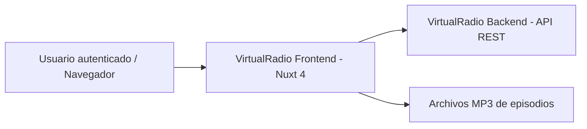
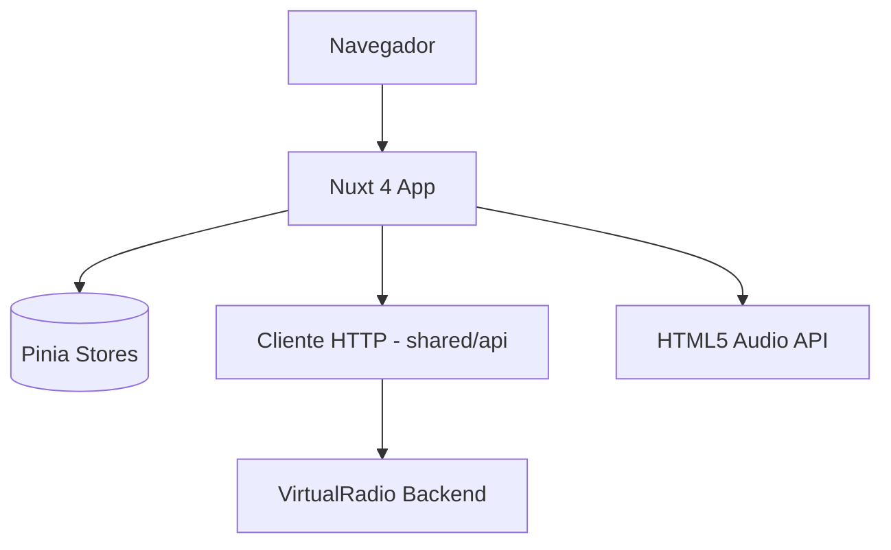
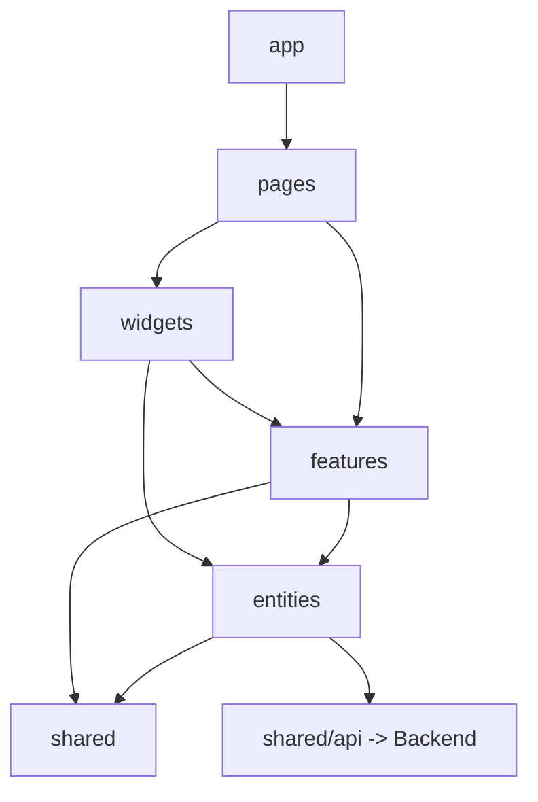

# Arquitectura del Proyecto – VirtualRadio (Frontend)

## 1. Información General

**Proyecto:** VirtualRadio – Cliente Web

**Versión del Documento:** 1.0

**Fecha:** 2026-06-15

**Responsables:** Equipo de Frontend

**Descripción General**
Este documento describe la arquitectura técnica del frontend de **VirtualRadio**: un panel de control web (Nuxt 4) desde el que un usuario autenticado gestiona sus estaciones de radio, su universo narrativo compartido (noticias, comerciales, personajes), su biblioteca musical, dispara la generación de episodios por agentes y reproduce/visualiza los episodios resultantes. La aplicación se organiza siguiendo **Feature-Sliced Design (FSD)** y usa **SASS** directamente para los estilos. El objetivo es servir como referencia corporativa para equipos técnicos, stakeholders y auditorías futuras.

---

## 2. Alcance del Documento

Este documento cubre:
- Arquitectura de software a nivel sistema (cliente web)
- Principales decisiones arquitectónicas (ADR)
- Estructura del proyecto y convenciones (Feature-Sliced Design)
- Patrones de diseño y principios técnicos

Fuera de alcance:
- Detalles de implementación específicos de bajo nivel (componentes individuales)
- Manuales de operación o despliegue
- Contrato detallado de la API (ver `docs/backend/arquitectura-backend.md`)

---

## 3. Contexto del Sistema (C4 – Nivel 1)

### 3.1 Descripción

El frontend es una aplicación Nuxt 4 (Vue 3) consumida por un **usuario autenticado** desde el navegador. Se comunica exclusivamente con el **backend de VirtualRadio** vía API REST (JSON) usando un token JWT. Reproduce el audio de los episodios generados (servidos como archivos MP3 por el backend) mediante la HTML5 Audio API. No habla directamente con ningún servicio de IA, TTS ni base de datos: toda esa orquestación es responsabilidad del backend.

### 3.2 Diagrama de Contexto



---

## 4. Contenedores del Sistema (C4 – Nivel 2)

### 4.1 Descripción de Contenedores

| Contenedor | Tecnología | Responsabilidad |
|-----------|------------|-----------------|
| Aplicación Web | Nuxt 4 (Vue 3, SSR/SPA) sobre Bun | Renderizar la UI, gestionar el estado y consumir la API |
| Cliente HTTP | `$fetch` / `useFetch` (Nuxt) | Comunicación con la API REST e inyección del JWT |
| Almacén de Estado | Pinia | Estado de sesión y de entidades del dominio |
| Estilos | SASS (SCSS) | Sistema de diseño (variables, mixins) y estilos por slice |

### 4.2 Diagrama de Contenedores



---

## 5. Componentes Principales (C4 – Nivel 3)

### 5.1 Organización Lógica

El frontend se organiza siguiendo **Feature-Sliced Design (FSD)**, una arquitectura por capas con dirección de dependencias estricta: cada capa **solo puede importar de capas inferiores**. Las capas, de mayor a menor nivel, son:

| Capa (FSD) | Responsabilidad |
|-----|-----------------|
| app | Inicialización de la app, providers, plugins, estilos globales, layouts |
| pages | Composición de páginas/rutas (mapeadas al router de archivos de Nuxt) |
| widgets | Bloques de UI compuestos y autónomos (barra lateral, reproductor, modal de pipeline) |
| features | Acciones del usuario con valor de negocio (login, generar episodio, sugerir contenido IA) |
| entities | Entidades del dominio (estación, episodio, personaje…) con su UI, modelo y API |
| shared | Código reutilizable sin lógica de negocio (cliente API, UI base, helpers, estilos SCSS) |

Dentro de cada *slice* se usan **segmentos** estándar: `ui/` (componentes), `model/` (estado Pinia y lógica), `api/` (llamadas al backend), `lib/` (utilidades) y `config/` (constantes). Cada slice expone su API pública mediante un `index.ts` (*public API*); está prohibido importar archivos internos de otro slice.

**Integración FSD + Nuxt 4:** el enrutado por archivos de Nuxt (`app/pages/`) cumple el rol de la capa `pages` de FSD; las páginas solo **componen widgets y features** y no contienen lógica de negocio. El resto de capas FSD vive bajo `app/` (o `src/`) y se conecta mediante alias de importación.

### 5.2 Diagrama de Componentes



---

## 6. Stack Tecnológico

### 6.1 Tecnologías Principales

- Runtime: Bun (ejecución, gestor de paquetes y test runner)
- Lenguaje: TypeScript (modo `strict`) / Vue 3 (Composition API, `<script setup>`)
- Framework: Nuxt 4
- Persistencia: N/A en cliente (estado en Pinia; consume API REST del backend)
- Mensajería / Cache: Cache de `useFetch`/`useAsyncData` de Nuxt; estado de sesión persistido (cookie/localStorage para el JWT)

### 6.2 Herramientas de Soporte

- Gestor de paquetes / scripts: Bun (`bun install`, `bun run`)
- Testing: Vitest + Vue Test Utils + Playwright (E2E), ejecutados sobre Bun
- Tipado: TypeScript en modo `strict` con `vue-tsc` para chequeo de tipos
- Linting / Formatting: ESLint (con `eslint-plugin-boundaries` o `steiger` para validar los límites FSD) + Prettier + Stylelint (SCSS)
- Observabilidad: logging en cliente + captura de errores (ej. Sentry) opcional
- Estilos: SASS (SCSS) directo, sin frameworks CSS (no Tailwind/Bootstrap)
- Estado: Pinia

---

## 7. Estructura del Proyecto

```
frontend/
├── app/
│   ├── app.vue                 # raíz (capa app)
│   ├── layouts/                # layouts (sidebar + contenido)
│   ├── pages/                  # capa pages (router de archivos Nuxt)
│   │   ├── login.vue
│   │   ├── index.vue           # estaciones
│   │   ├── episodes.vue
│   │   ├── news.vue
│   │   ├── commercials.vue
│   │   ├── characters.vue
│   │   └── music.vue
│   ├── widgets/                # capa widgets
│   │   ├── sidebar-nav/
│   │   ├── station-grid/
│   │   ├── episode-player/
│   │   ├── generation-pipeline-modal/
│   │   └── universe-summary/
│   ├── features/               # capa features
│   │   ├── auth-login/
│   │   ├── generate-episode/
│   │   ├── play-episode/
│   │   ├── suggest-content/
│   │   ├── upload-music/
│   │   └── manage-<entity>/    # CRUD por entidad
│   ├── entities/               # capa entities
│   │   ├── session/            # usuario autenticado
│   │   ├── station/
│   │   ├── episode/
│   │   ├── character/
│   │   ├── news-item/
│   │   ├── commercial/
│   │   ├── brand/
│   │   └── music-track/
│   └── shared/                 # capa shared
│       ├── api/                # cliente $fetch + interceptores JWT
│       ├── ui/                 # componentes base (botón, card, input, modal)
│       ├── lib/                # utilidades
│       ├── config/             # constantes, runtimeConfig helpers
│       └── styles/             # SCSS: _variables, _mixins, _global
├── middleware/                 # guardas de ruta (auth)
├── nuxt.config.ts
├── package.json
└── Dockerfile
```

> Cada slice (p. ej. `entities/station/`) contiene sus segmentos `ui/`, `model/`, `api/` y un `index.ts` con su API pública.

---

## 8. Convenciones de API

### 8.1 Convención de URLs

El frontend consume el backend bajo el prefijo:

```
/api/v1/{modulo}/{recurso}
```

La URL base se configura vía `runtimeConfig.public.apiBase` (variable de entorno `NUXT_PUBLIC_API_BASE`), **nunca hardcodeada**. Todas las llamadas pasan por `shared/api`, que adjunta el header `Authorization: Bearer <jwt>`.

### 8.2 Estructura de Respuestas

El cliente espera el contrato del backend:

**Respuesta Exitosa**
```json
{
  "data": {},
  "meta": {}
}
```

**Respuesta de Error**
```json
{
  "error": {
    "code": "ERROR_CODE",
    "message": "Descripción del error",
    "details": {}
  }
}
```

El interceptor de `shared/api` desempaqueta `data`, propaga `error` de forma tipada y, ante un `401`, redirige al login limpiando la sesión.

---

## 9. Seguridad

- Autenticación: **JWT** obtenido en la feature `auth-login`; se almacena de forma segura (cookie `httpOnly` vía proxy Nuxt o `localStorage` según configuración) y se adjunta en cada request desde `shared/api`.
- Autorización: la UI refleja el modelo del backend (un único rol `USER`, scope `own`): el usuario solo ve y opera sobre sus propios datos. El backend es la fuente de verdad; el cliente no toma decisiones de autorización sensibles.
- Principio de mínimo privilegio aplicado: las rutas protegidas usan un **middleware de guarda** que redirige a `/login` si no hay sesión válida.

---

## 10. Manejo de Errores

| Código | Significado |
|------|-------------|
| 400 | Bad Request |
| 401 | Unauthorized |
| 403 | Forbidden |
| 404 | Not Found |
| 422 | Validation Error |
| 500 | Internal Server Error |

En el cliente: el `401` fuerza logout y redirección a login; `422` se mapea a errores de formulario por campo; `404`/`403` muestran estados vacíos o de acceso denegado; `500` muestra un aviso genérico con opción de reintento.

---

## 11. Principios Arquitectónicos

- Separación de responsabilidades (capas FSD con dependencia unidireccional)
- Escalabilidad y mantenibilidad (slices autónomos con API pública explícita)
- Observabilidad desde el diseño
- Seguridad por defecto (rutas protegidas, JWT centralizado)
- Co-localización: la UI, el estado y las llamadas de una entidad/feature viven juntos en su slice.

---

## 12. Architecture Decision Records (ADR)

Las decisiones arquitectónicas relevantes deben documentarse siguiendo el formato ADR.

### 12.1 Formato ADR

| Campo | Descripción |
|-----|------------|
| ID | ADR-XXX |
| Fecha | YYYY-MM-DD |
| Estado | Propuesto / Aceptado / Deprecado |
| Contexto | Situación que motiva la decisión |
| Decisión | Decisión tomada |
| Consecuencias | Impactos positivos y negativos |

### 12.2 Registro de ADRs

| ID | Fecha | Estado | Decisión |
|----|-------|--------|----------|
| ADR-001 | 2026-06-15 | Aceptado | Descomponer el `app.vue` monolítico del prototipo en una arquitectura Feature-Sliced Design |
| ADR-002 | 2026-06-15 | Aceptado | Actualizar de Nuxt 3 a Nuxt 4 |
| ADR-003 | 2026-06-15 | Aceptado | Usar SASS (SCSS) directamente para el sistema de diseño, sin frameworks CSS |
| ADR-004 | 2026-06-15 | Aceptado | Adoptar Pinia para el estado, ubicando cada store en el segmento `model/` de su slice |
| ADR-005 | 2026-06-15 | Aceptado | Centralizar HTTP en `shared/api` con base URL por `runtimeConfig` (no hardcodear) |
| ADR-006 | 2026-06-15 | Aceptado | Introducir login JWT con middleware de guarda en rutas protegidas |
| ADR-007 | 2026-06-15 | Aceptado | Usar Bun como runtime, gestor de paquetes y test runner del frontend (en lugar de Node.js/npm) |
| ADR-008 | 2026-06-15 | Aceptado | Desarrollar todo el frontend en TypeScript con `strict` activado y chequeo de tipos con `vue-tsc` |

---

## 13. Notas y Consideraciones Finales

- Los tokens de diseño del prototipo (variables CSS como `--bg-deep`, `--primary` ámbar, `--secondary` púrpura, radios y sombras) se migran a `shared/styles/_variables.scss` y `_mixins.scss`, conservando la identidad visual oscura existente.
- El seguimiento de la generación de episodios se implementa como una feature (`generate-episode`) que dispara el job y hace *polling* a `GET /api/v1/jobs/{id}`, alimentando el widget `generation-pipeline-modal`.
- Se recomienda validar automáticamente los límites de importación FSD en CI (linter de fronteras) para preservar la regla de dependencias entre capas.
- La elección entre SSR y SPA pura se define en `nuxt.config.ts`; por tratarse de un panel autenticado, se puede optar por render del lado cliente para las vistas privadas, manteniendo SSR solo donde aporte valor.
