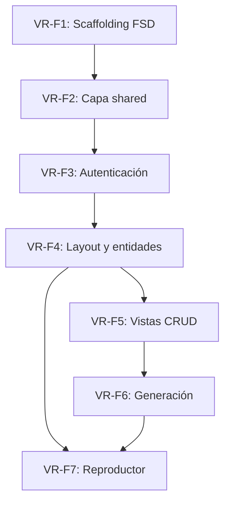

# Plan de Implementación - VirtualRadio Frontend
## VirtualRadio v1.0 - Panel de control web (Nuxt 4 + SASS + FSD)

**Versión:** 1.0
**Fecha:** Junio 2026
**Total de Historias:** 7
**Total de Tareas:** 20
**Story Points Estimados:** 89 SP

---

## Tabla de Contenidos

1. [Resumen Ejecutivo](#resumen-ejecutivo)
2. [Estructura del Plan](#estructura-del-plan)
3. [Historias de Usuario](#historias-de-usuario)
4. [Resumen de Estimación](#resumen-de-estimación)
5. [Orden de Implementación Recomendado](#orden-de-implementación-recomendado)
6. [Dependencias Críticas](#dependencias-críticas)
7. [Riesgos y Mitigaciones](#riesgos-y-mitigaciones)
8. [Métricas de Éxito](#métricas-de-éxito)
9. [Notas Finales](#notas-finales)

---

## Resumen Ejecutivo

VirtualRadio Frontend es el panel de control web desde el que un usuario autenticado gestiona su universo de radio (estaciones, noticias, comerciales, personajes, música), dispara la generación de episodios por agentes y reproduce/visualiza los resultados. Resuelve la necesidad de una interfaz clara y mantenible para operar el backend de VirtualRadio. El presente plan describe la construcción del frontend **desde cero** sobre el stack final (Nuxt 4, SASS, Pinia) organizado con **Feature-Sliced Design (FSD)**, tomando el prototipo (Nuxt 3 monolítico) como referencia funcional.

### Características Clave
- **Arquitectura FSD**: capas app/pages/widgets/features/entities/shared con dependencia unidireccional y slices autónomos.
- **Autenticación**: login JWT, guardas de ruta y sesión persistida.
- **Gestión del universo**: vistas CRUD de estaciones, noticias, comerciales, personajes y música, con sugerencias por IA.
- **Generación de episodios**: disparo del job y seguimiento del pipeline en tiempo real (polling) con visualización por pasos.
- **Reproductor de episodios**: player de audio personalizado con timeline del guion (speech/music/fx).

### Stack Tecnológico
- **Runtime**: Bun (ejecución, gestor de paquetes y test runner)
- **Framework**: Nuxt 4 (Vue 3, Composition API)
- **Database**: N/A (consume API REST del backend)
- **Cache**: `useFetch`/`useAsyncData` de Nuxt; sesión persistida (cookie/localStorage)
- **Estilos**: SASS (SCSS) directo, sin frameworks CSS
- **Process Manager**: Docker / docker-compose

---

## Estructura del Plan

Este plan está organizado en **7 Historias de Usuario** principales, cada una con múltiples **Tareas Técnicas** detalladas.

| Historia | Nombre | Story Points | Tareas | Prioridad |
|----------|--------|--------------|--------|-----------|
| **VR-F1** | Scaffolding Nuxt 4 + FSD + SASS | 13 SP | 3 | Highest |
| **VR-F2** | Capa shared: API, UI base y estilos | 13 SP | 3 | Highest |
| **VR-F3** | Autenticación y guardas de ruta | 13 SP | 3 | Highest |
| **VR-F4** | Layout, navegación y entidades | 13 SP | 3 | High |
| **VR-F5** | Vistas CRUD del universo + sugerencias IA | 21 SP | 4 | High |
| **VR-F6** | Generación de episodios y seguimiento | 8 SP | 2 | High |
| **VR-F7** | Reproductor y catálogo de episodios | 8 SP | 2 | Medium |

---

## Historias de Usuario

---

## VR-F1: Scaffolding Nuxt 4 + FSD + SASS

**Tipo**: Story
**Prioridad**: Highest
**Story Points**: 13 SP

**Como** desarrollador del equipo
**Quiero** un proyecto Nuxt 4 estructurado con las capas de FSD y SASS configurado
**Para** desarrollar funcionalidades de forma mantenible y consistente

**Descripción**:
Se inicializa el proyecto Nuxt 4 y se establece la estructura de carpetas de Feature-Sliced Design (app/pages/widgets/features/entities/shared) con alias de importación, la configuración de SASS y el linter de fronteras FSD. Es la base de todo el frontend.

**Criterios de Aceptación**:
- ✅ Proyecto Nuxt 4 arranca en desarrollo y build de producción
- ✅ Estructura FSD creada con alias de importación por capa
- ✅ SASS configurado con `_variables.scss` y `_mixins.scss` globales
- ✅ Linter de fronteras valida la regla de dependencias entre capas

**Tareas Técnicas**:

---

### VR-F1.1: Inicialización del proyecto Nuxt 4
**Tipo**: Task
**Story Points**: 5 SP

**Subtareas**:
- [ ] Crear proyecto Nuxt 4 con TypeScript (`tsconfig` en modo `strict`) usando Bun como runtime y gestor de paquetes (`bun install` / `bun run`)
- [ ] Configurar `nuxt.config.ts` (modo render, `runtimeConfig.public.apiBase`, Pinia) y chequeo de tipos con `vue-tsc`
- [ ] Configurar Dockerfile del frontend con imagen base de Bun e integración con docker-compose

**Dependencias**: —

---

### VR-F1.2: Estructura FSD y alias
**Tipo**: Task
**Story Points**: 5 SP

**Subtareas**:
- [ ] Crear carpetas `app/{pages,widgets,features,entities,shared}`
- [ ] Definir alias de importación por capa y convención de `index.ts` (API pública por slice)
- [ ] Integrar el routing de archivos de Nuxt como capa `pages`

**Dependencias**: VR-F1.1

---

### VR-F1.3: SASS y linter de fronteras
**Tipo**: Task
**Story Points**: 3 SP

**Subtareas**:
- [ ] Configurar SASS (auto-import de `_variables`/`_mixins`)
- [ ] Configurar ESLint + Stylelint + plugin de fronteras FSD
- [ ] Definir convenciones de nomenclatura de slices y segmentos

**Dependencias**: VR-F1.2

---

## VR-F2: Capa shared: API, UI base y estilos

**Tipo**: Story
**Prioridad**: Highest
**Story Points**: 13 SP

**Como** desarrollador del equipo
**Quiero** un cliente HTTP centralizado, componentes base y un sistema de diseño SCSS
**Para** que todas las capas superiores reutilicen infraestructura común

**Descripción**:
Se construye la capa `shared`: el cliente `$fetch` con inyección de JWT y manejo del contrato `{data}`/`{error}`, los componentes de UI base (botón, card, input, modal, select) y los tokens de diseño SCSS migrados del prototipo (paleta oscura, ámbar/púrpura, radios y sombras).

**Criterios de Aceptación**:
- ✅ `shared/api` adjunta el JWT y desempaqueta `data`/propaga `error`
- ✅ Ante `401`, limpia sesión y redirige a login
- ✅ Componentes base reutilizables y tematizados con SCSS
- ✅ Tokens de diseño centralizados en `shared/styles`

**Tareas Técnicas**:

---

### VR-F2.1: Cliente HTTP centralizado
**Tipo**: Task
**Story Points**: 5 SP

**Subtareas**:
- [ ] Wrapper de `$fetch` con base URL desde `runtimeConfig`
- [ ] Interceptores: `Authorization`, manejo de errores y `401`
- [ ] Tipado de respuestas (`data`/`meta`/`error`)

**Dependencias**: VR-F1.2

---

### VR-F2.2: Sistema de diseño SCSS
**Tipo**: Task
**Story Points**: 5 SP

**Subtareas**:
- [ ] Migrar tokens del prototipo a `_variables.scss` (colores, radios, sombras)
- [ ] Mixins de layout, tipografía y scrollbars
- [ ] Estilos globales y tipografías (Outfit / JetBrains Mono)

**Dependencias**: VR-F1.3

---

### VR-F2.3: Componentes UI base
**Tipo**: Task
**Story Points**: 3 SP

**Subtareas**:
- [ ] Botones, card, input, select, badge y modal
- [ ] Estados de carga/vacío/error reutilizables
- [ ] Documentar API pública de `shared/ui`

**Dependencias**: VR-F2.2

---

## VR-F3: Autenticación y guardas de ruta

**Tipo**: Story
**Prioridad**: Highest
**Story Points**: 13 SP

**Como** usuario
**Quiero** iniciar sesión y mantener mi sesión
**Para** acceder de forma segura a mi propio universo de datos

**Descripción**:
Se implementa la entidad `session` y la feature `auth-login`: formularios de login/registro, almacenamiento del JWT, store de sesión (Pinia) y middleware de guarda que protege las rutas privadas redirigiendo a `/login`.

**Criterios de Aceptación**:
- ✅ Página de login/registro funcional contra `/api/v1/auth/*`
- ✅ JWT persistido y restaurado al recargar
- ✅ Middleware redirige a login si no hay sesión válida
- ✅ Logout limpia la sesión y el token

**Tareas Técnicas**:

---

### VR-F3.1: Entidad session y store
**Tipo**: Task
**Story Points**: 5 SP

**Subtareas**:
- [ ] Store Pinia de sesión (usuario, token, estado)
- [ ] Persistencia y restauración del token
- [ ] API pública de la entidad `session`

**Dependencias**: VR-F2.1

---

### VR-F3.2: Feature auth-login
**Tipo**: Task
**Story Points**: 5 SP

**Subtareas**:
- [ ] Formularios de login y registro con validación
- [ ] Página `pages/login.vue` que compone la feature
- [ ] Manejo de errores de credenciales (401/422)

**Dependencias**: VR-F3.1

---

### VR-F3.3: Middleware de guarda
**Tipo**: Task
**Story Points**: 3 SP

**Subtareas**:
- [ ] Middleware de ruta para vistas privadas
- [ ] Redirección a login y retorno post-login
- [ ] Acción de logout

**Dependencias**: VR-F3.2

---

## VR-F4: Layout, navegación y entidades

**Tipo**: Story
**Prioridad**: High
**Story Points**: 13 SP

**Como** usuario
**Quiero** una navegación clara entre secciones
**Para** moverme entre estaciones, episodios y el universo narrativo

**Descripción**:
Se construye el layout principal (barra lateral + contenido), el widget `sidebar-nav`, el indicador de conexión y el widget `universe-summary`. Se definen las **entidades** del dominio (station, episode, character, news-item, commercial, brand, music-track) con su modelo, API y UI de tarjeta/listado.

**Criterios de Aceptación**:
- ✅ Layout con sidebar navegable entre las 6 secciones
- ✅ Entidades del dominio con su slice (ui/model/api) y API pública
- ✅ Resumen del universo con conteos
- ✅ Indicador de estado de conexión con el backend

**Tareas Técnicas**:

---

### VR-F4.1: Layout y sidebar-nav
**Tipo**: Task
**Story Points**: 5 SP

**Subtareas**:
- [ ] Layout principal (sidebar fija + área scrollable)
- [ ] Widget `sidebar-nav` con navegación y branding
- [ ] Indicador de conexión y cabecera por sección

**Dependencias**: VR-F2.3, VR-F3.3

---

### VR-F4.2: Slices de entidades
**Tipo**: Task
**Story Points**: 5 SP

**Subtareas**:
- [ ] Modelos/tipos y stores por entidad (station, episode, character, news-item, commercial, brand, music-track)
- [ ] API por entidad sobre `shared/api`
- [ ] Componentes de tarjeta/listado reutilizables

**Dependencias**: VR-F4.1

---

### VR-F4.3: Widget universe-summary
**Tipo**: Task
**Story Points**: 3 SP

**Subtareas**:
- [ ] Conteos del universo (personajes, noticias, comerciales, pistas)
- [ ] Carga inicial de datos al montar
- [ ] Manejo de estados de carga/error

**Dependencias**: VR-F4.2

---

## VR-F5: Vistas CRUD del universo + sugerencias IA

**Tipo**: Story
**Prioridad**: High
**Story Points**: 21 SP

**Como** usuario
**Quiero** crear y gestionar estaciones, noticias, comerciales y personajes
**Para** construir mi universo narrativo, con ayuda de sugerencias por IA

**Descripción**:
Se implementan las páginas y features CRUD para cada recurso del universo, incluyendo los botones de **sugerencia por IA** que rellenan los formularios desde los endpoints `/suggest`, y la vista de memorias del personaje.

**Criterios de Aceptación**:
- ✅ CRUD de estaciones, noticias, marcas, comerciales y personajes
- ✅ Sugerencias IA pueblan los formularios y permiten editar antes de guardar
- ✅ Vista de memorias narrativas por personaje
- ✅ Validación y feedback de errores por campo

**Tareas Técnicas**:

---

### VR-F5.1: Estaciones
**Tipo**: Task
**Story Points**: 5 SP

**Subtareas**:
- [ ] Página de estaciones (grid de tarjetas)
- [ ] Feature de creación/edición con formulario
- [ ] Feature `suggest-content` para estación

**Dependencias**: VR-F4.2

---

### VR-F5.2: Noticias y comerciales/marcas
**Tipo**: Task
**Story Points**: 8 SP

**Subtareas**:
- [ ] Página de noticias (lista + formulario, badges de categoría/tono)
- [ ] Página de comerciales (marcas + comerciales) con selector de marca
- [ ] Sugerencias IA para noticia, marca y comercial

**Dependencias**: VR-F5.1

---

### VR-F5.3: Personajes y memorias
**Tipo**: Task
**Story Points**: 5 SP

**Subtareas**:
- [ ] Página de personajes (grid + formulario)
- [ ] Sugerencia IA de personaje
- [ ] Carga perezosa de memorias por personaje

**Dependencias**: VR-F5.1

---

### VR-F5.4: Biblioteca musical
**Tipo**: Task
**Story Points**: 3 SP

**Subtareas**:
- [ ] Página de música (tabla con metadatos y duración total)
- [ ] Feature `upload-music` (subida MP3)
- [ ] Acción de escaneo de carpeta

**Dependencias**: VR-F4.2

---

## VR-F6: Generación de episodios y seguimiento

**Tipo**: Story
**Prioridad**: High
**Story Points**: 8 SP

**Como** usuario
**Quiero** generar un episodio desde una estación y ver el progreso
**Para** obtener mi programa de radio y entender en qué paso está

**Descripción**:
Se implementa la feature `generate-episode` (dispara el job) y el widget `generation-pipeline-modal` que hace polling a `GET /jobs/{id}` y muestra los pasos del pipeline (planner → voces → mezcla) con barra de progreso y logs.

**Criterios de Aceptación**:
- ✅ Botón "Generar episodio" en cada estación
- ✅ Modal con progreso por pasos y polling cada ~1s
- ✅ Al completar, se selecciona/carga el episodio nuevo
- ✅ Manejo de fallo del job con mensaje claro

**Tareas Técnicas**:

---

### VR-F6.1: Feature generate-episode
**Tipo**: Task
**Story Points**: 5 SP

**Subtareas**:
- [ ] Disparo de `POST /episodes/generate` y obtención del job
- [ ] Polling de estado y mapeo a pasos del pipeline
- [ ] Limpieza del intervalo al desmontar

**Dependencias**: VR-F5.1

---

### VR-F6.2: Widget generation-pipeline-modal
**Tipo**: Task
**Story Points**: 3 SP

**Subtareas**:
- [ ] Visualización de pasos, barra de progreso y logs
- [ ] Estados completado/fallido
- [ ] Acción de cerrar (deshabilitada hasta terminar)

**Dependencias**: VR-F6.1

---

## VR-F7: Reproductor y catálogo de episodios

**Tipo**: Story
**Prioridad**: Medium
**Story Points**: 8 SP

**Como** usuario
**Quiero** reproducir y explorar mis episodios
**Para** escuchar el resultado y revisar su guion

**Descripción**:
Se implementa la página de episodios con el catálogo y el widget `episode-player`: reproductor de audio personalizado (HTML5 Audio API) con controles, ecualizador animado y timeline del guion (segmentos speech/music/fx).

**Criterios de Aceptación**:
- ✅ Listado de episodios y selección
- ✅ Reproductor con play/pausa, scrubber y volumen
- ✅ Timeline del guion con avatares, efectos y música
- ✅ Acción de eliminar episodio

**Tareas Técnicas**:

---

### VR-F7.1: Catálogo de episodios
**Tipo**: Task
**Story Points**: 3 SP

**Subtareas**:
- [ ] Página/listado de episodios con selección
- [ ] Acción de borrado
- [ ] Estados de carga/vacío

**Dependencias**: VR-F4.2

---

### VR-F7.2: Widget episode-player
**Tipo**: Task
**Story Points**: 5 SP

**Subtareas**:
- [ ] Reproductor personalizado (play/pausa, timeline, volumen)
- [ ] Ecualizador animado
- [ ] Render del timeline del guion (speech/music/fx)

**Dependencias**: VR-F7.1

---

## Resumen de Estimación

### Por Historia

| Historia | Story Points | % del Total | Tareas |
|----------|--------------|-------------|--------|
| VR-F1 - Scaffolding Nuxt 4 + FSD + SASS | 13 SP | 14.6% | 3 |
| VR-F2 - Capa shared (API, UI, estilos) | 13 SP | 14.6% | 3 |
| VR-F3 - Autenticación y guardas | 13 SP | 14.6% | 3 |
| VR-F4 - Layout, navegación y entidades | 13 SP | 14.6% | 3 |
| VR-F5 - Vistas CRUD + sugerencias IA | 21 SP | 23.6% | 4 |
| VR-F6 - Generación y seguimiento | 8 SP | 9.0% | 2 |
| VR-F7 - Reproductor y catálogo | 8 SP | 9.0% | 2 |
| **TOTAL** | **89 SP** | **100%** | **20** |

### Por Prioridad

| Prioridad | Story Points | Historias | % del Total |
|-----------|--------------|-----------|-------------|
| Highest | 39 SP | 3 | 43.8% |
| High | 42 SP | 3 | 47.2% |
| Medium | 8 SP | 1 | 9.0% |
| Low | 0 SP | 0 | 0% |

### Estimación de Tiempo

Asumiendo una velocidad **individual de ~10 SP por sprint (2 semanas)**, la velocidad de equipo escala con el nº de desarrolladores:

- **Con 1 desarrollador** (~10 SP/sprint): ~9 sprints → **~18 semanas (~4.5 meses)**
- **Con 2 desarrolladores** (~20 SP/sprint): ~5 sprints → **~10 semanas (~2.5 meses)**

> El plan de "Orden de Implementación Recomendado" (sprints 1-5) asume la línea base de 2 desarrolladores (~20 SP/sprint).

---

## Orden de Implementación Recomendado

### Sprint 1-2: Cimientos (39 SP)
1. VR-F1: Scaffolding Nuxt 4 + FSD + SASS (13 SP)
2. VR-F2: Capa shared (13 SP)
3. VR-F3: Autenticación y guardas (13 SP)

### Sprint 3-4: Dominio y vistas (34 SP)
4. VR-F4: Layout, navegación y entidades (13 SP)
5. VR-F5: Vistas CRUD del universo + sugerencias IA (21 SP)

### Sprint 5: Generación y episodios (16 SP)
6. VR-F6: Generación de episodios y seguimiento (8 SP)
7. VR-F7: Reproductor y catálogo de episodios (8 SP)

---

## Dependencias Críticas

**Notas sobre Dependencias**:
- El camino crítico es F1 → F2 → F3 → F4 → F5 → F6.
- La capa `shared` (F2) es prerequisito de todo: el cliente API y el sistema de diseño se reutilizan en todas las features.
- VR-F7 (reproductor) puede avanzar en paralelo a VR-F6 una vez existan las entidades (F4).

---

## Riesgos y Mitigaciones

### Riesgos Técnicos

| Riesgo | Probabilidad | Impacto | Mitigación |
|--------|--------------|---------|------------|
| Violaciones de la regla de dependencias FSD | Media | Medio | Linter de fronteras en CI + revisión de la API pública por slice |
| Deriva hacia un componente monolítico (como el prototipo) | Media | Alto | Slices pequeños con responsabilidad única y co-localización |
| Manejo de JWT inseguro en cliente | Media | Alto | Centralizar token en `shared/api`/sesión; preferir cookie httpOnly vía proxy |
| Polling de jobs ineficiente | Baja | Bajo | Intervalo configurable y limpieza al desmontar |

### Riesgos de UX

| Riesgo | Probabilidad | Impacto | Mitigación |
|--------|--------------|---------|------------|
| Estados de carga/error inconsistentes | Media | Medio | Componentes de estado reutilizables en `shared/ui` |
| Feedback pobre durante la generación (proceso largo) | Media | Medio | Modal de pipeline con pasos y progreso claros |

### Riesgos de Mantenibilidad

| Riesgo | Probabilidad | Impacto | Mitigación |
|--------|--------------|---------|------------|
| Estilos duplicados/divergentes | Media | Bajo | Tokens y mixins centralizados en `shared/styles` |
| Lógica de negocio filtrada a `pages` | Media | Medio | Páginas solo componen widgets/features (regla FSD) |

---

## Métricas de Éxito

### Métricas Técnicas
- **Build de producción**: sin errores y dentro de presupuesto de tamaño de bundle
- **Violaciones de fronteras FSD**: 0 en CI
- **Cobertura de tests**: > 70% en features y entities (Vitest)
- **Tiempo de interacción (TTI)** de vistas privadas: aceptable en hardware estándar

### Métricas de Negocio
- **Tasa de finalización de generación desde la UI**: > 95%
- **Adopción de sugerencias IA**: % de creaciones que parten de `/suggest`
- **Episodios reproducidos por sesión**: en crecimiento

### Métricas de Calidad
- **Errores en consola en producción**: ~0
- **Accesibilidad básica**: navegación por teclado y contraste correctos

---

## Notas Finales

### Convenciones de Código
- Vue 3 `<script setup>` + TypeScript en modo `strict` (sin `any` implícitos)
- Bun como runtime y gestor de paquetes (`bun install`, `bun run`); scripts del proyecto sobre Bun
- Feature-Sliced Design: importar solo de capas inferiores; API pública por `index.ts`
- Estilos en SCSS co-localizados por slice; tokens en `shared/styles`
- Branching trunk-based con code review obligatorio

### Herramientas Recomendadas
- **Runtime / Paquetes**: Bun
- **Tipado**: TypeScript (`strict`), `vue-tsc`
- **Testing**: Vitest, Vue Test Utils, Playwright (E2E) sobre Bun
- **Calidad**: ESLint (+ plugin de fronteras FSD), Prettier, Stylelint
- **Estado**: Pinia
- **Contenedores**: Docker, docker-compose

### Documentación Adicional
- **Arquitectura**: `docs/frontend/arquitectura-frontend.md`
- **Arquitectura backend**: `docs/backend/arquitectura-backend.md`
- **RBAC**: `docs/backend/rbac.md`

### Contacto y Soporte
- **Tech Lead Frontend**: por definir
- **Product Owner**: por definir

### Enlaces Útiles
- [Repositorio del Proyecto]: por definir
- [Documentación]: `docs/`
- [Board de Proyecto]: por definir
- [CI/CD Pipeline]: por definir

---

**Fin del Documento**
