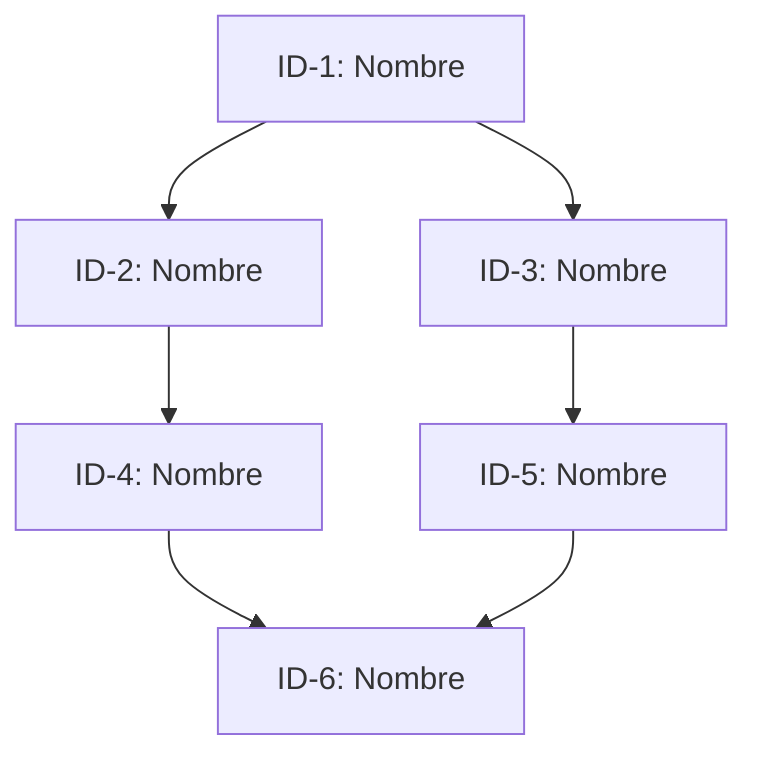

# [PLANTILLA] Plan de Implementación - [Nombre del Servicio]
## [Nombre del Proyecto] v[Versión] - [Descripción Corta]

**Versión:** [X.X]  
**Fecha:** [Mes Año]  
**Total de Historias:** [N]  
**Total de Tareas:** [N]  
**Story Points Estimados:** [N] SP

---

## Tabla de Contenidos

1. [Resumen Ejecutivo](#resumen-ejecutivo)
2. [Estructura del Plan](#estructura-del-plan)
3. [Historias de Usuario](#historias-de-usuario)
4. [Resumen de Estimación](#resumen-de-estimación)
5. [Orden de Implementación Recomendado](#orden-de-implementación-recomendado)
6. [Dependencias Críticas](#dependencias-críticas)
7. [Riesgos y Mitigaciones](#riesgos-y-mitigaciones)
8. [Métricas de Éxito](#métricas-de-éxito)
9. [Notas Finales](#notas-finales)

---

## Resumen Ejecutivo

[Descripción general del proyecto y su propósito. Explica qué problema resuelve y cuál es su valor.]

### Características Clave
- **[Característica 1]**: [Descripción breve de la funcionalidad]
- **[Característica 2]**: [Descripción breve de la funcionalidad]
- **[Característica 3]**: [Descripción breve de la funcionalidad]
- **[Característica N]**: [Descripción breve de la funcionalidad]

### Stack Tecnológico
- **Runtime**: [Tecnologías de ejecución]
- **Framework**: [Framework principal]
- **Database**: [Base de datos]
- **Cache**: [Sistema de cache]
- **[Categoría]**: [Tecnologías adicionales]
- **Process Manager**: [Gestor de procesos]

---

## Estructura del Plan

Este plan está organizado en **[N] Historias de Usuario** principales, cada una con múltiples **Tareas Técnicas** detalladas.

| Historia | Nombre | Story Points | Tareas | Prioridad |
|----------|--------|--------------|--------|-----------|
| **[ID-1]** | [Nombre Historia 1] | [N] SP | [N] | [Highest/High/Medium/Low] |
| **[ID-2]** | [Nombre Historia 2] | [N] SP | [N] | [Highest/High/Medium/Low] |
| **[ID-3]** | [Nombre Historia 3] | [N] SP | [N] | [Highest/High/Medium/Low] |
| **[ID-N]** | [Nombre Historia N] | [N] SP | [N] | [Highest/High/Medium/Low] |

---

## Historias de Usuario

---

## [ID-1]: [Nombre de la Historia]

**Tipo**: Story  
**Prioridad**: [Highest/High/Medium/Low]  
**Story Points**: [N] SP

**Como** [rol del usuario]  
**Quiero** [funcionalidad o capacidad deseada]  
**Para** [beneficio u objetivo que se busca]

**Descripción**:
[Descripción detallada de la historia de usuario. Explica el contexto, la motivación y los detalles importantes sobre qué se necesita implementar y por qué.]

**Criterios de Aceptación**:
- ✅ [Criterio 1: Condición específica que debe cumplirse]
- ✅ [Criterio 2: Condición específica que debe cumplirse]
- ✅ [Criterio 3: Condición específica que debe cumplirse]
- ✅ [Criterio N: Condición específica que debe cumplirse]

**Tareas Técnicas**:

---

### [ID-1.1]: [Nombre de la Tarea]
**Tipo**: Task  
**Story Points**: [N] SP

**Subtareas**:
- [ ] [Subtarea 1: Descripción detallada de la actividad]
- [ ] [Subtarea 2: Descripción detallada de la actividad]
- [ ] [Subtarea 3: Descripción detallada de la actividad]
  - [Detalle adicional si es necesario]
  - [Configuración específica]
- [ ] [Subtarea N: Descripción detallada de la actividad]

**Dependencias**: [ID-A.B], [ID-C.D]

---

### [ID-1.2]: [Nombre de la Tarea]
**Tipo**: Task  
**Story Points**: [N] SP

**Subtareas**:
- [ ] [Subtarea 1]
- [ ] [Subtarea 2]
- [ ] [Subtarea N]

**Dependencias**: [ID-A.B]

---

### [ID-1.N]: [Nombre de la Tarea]
**Tipo**: Task  
**Story Points**: [N] SP

**Subtareas**:
- [ ] [Subtarea 1]
- [ ] [Subtarea 2]
- [ ] [Subtarea N]

**Dependencias**: [ID-A.B], [ID-C.D]

---

## [ID-2]: [Nombre de la Historia]

**Tipo**: Story  
**Prioridad**: [Highest/High/Medium/Low]  
**Story Points**: [N] SP

**Como** [rol del usuario]  
**Quiero** [funcionalidad o capacidad deseada]  
**Para** [beneficio u objetivo que se busca]

**Descripción**:
[Descripción detallada de la historia]

**Criterios de Aceptación**:
- ✅ [Criterio 1]
- ✅ [Criterio 2]
- ✅ [Criterio N]

**Tareas Técnicas**:

---

### [ID-2.1]: [Nombre de la Tarea]
**Tipo**: Task  
**Story Points**: [N] SP

**Subtareas**:
- [ ] [Subtarea 1]
- [ ] [Subtarea 2]
- [ ] [Subtarea N]

**Dependencias**: [ID-A.B]

---

[Repetir estructura para cada historia de usuario adicional]

---

## Resumen de Estimación

### Por Historia

| Historia | Story Points | % del Total | Tareas |
|----------|--------------|-------------|--------|
| [ID-1] - [Nombre] | [N] SP | [X.X]% | [N] |
| [ID-2] - [Nombre] | [N] SP | [X.X]% | [N] |
| [ID-3] - [Nombre] | [N] SP | [X.X]% | [N] |
| [ID-N] - [Nombre] | [N] SP | [X.X]% | [N] |
| **TOTAL** | **[N] SP** | **100%** | **[N]** |

### Por Prioridad

| Prioridad | Story Points | Historias | % del Total |
|-----------|--------------|-----------|-------------|
| Highest | [N] SP | [N] | [X.X]% |
| High | [N] SP | [N] | [X.X]% |
| Medium | [N] SP | [N] | [X.X]% |
| Low | [N] SP | [N] | [X.X]% |

### Estimación de Tiempo

Asumiendo velocidad de equipo de **[N] SP por sprint ([N] semanas)**:

- **Sprints necesarios**: ~[N] sprints
- **Duración estimada**: ~[N] semanas ([N] meses)
- **Con [N] desarrolladores**: ~[N] semanas ([N] meses)
- **Con [N] desarrolladores**: ~[N] semanas ([N] meses)

---

## Orden de Implementación Recomendado

### Sprint [N-M]: [Nombre de Fase] ([N] SP)
1. [ID-X]: [Nombre de Historia o Tarea] ([N] SP)
2. [ID-Y]: [Nombre de Historia o Tarea] ([N] SP)
3. [ID-Z]: [Nombre de Historia o Tarea] ([N] SP) - inicio en paralelo

### Sprint [N-M]: [Nombre de Fase] ([N] SP)
4. [ID-A]: [Nombre de Historia o Tarea] ([N] SP)
5. [ID-B]: [Nombre de Historia o Tarea] ([N] SP)
6. [ID-C]: [Nombre de Historia o Tarea] ([N] SP)

### Sprint [N-M]: [Nombre de Fase] ([N] SP)
7. [ID-D]: [Nombre de Historia o Tarea] ([N] SP)
8. [ID-E]: [Nombre de Historia o Tarea] ([N] SP)

[Continuar con todos los sprints planificados]

---

## Dependencias Críticas

**Notas sobre Dependencias**:
- [Explicación de dependencias críticas del camino]
- [Identificación de posibles cuellos de botella]
- [Oportunidades de paralelización]

---

## Riesgos y Mitigaciones

### Riesgos Técnicos

| Riesgo | Probabilidad | Impacto | Mitigación |
|--------|--------------|---------|------------|
| [Descripción del riesgo técnico 1] | [Alta/Media/Baja] | [Crítico/Alto/Medio/Bajo] | [Estrategia de mitigación detallada] |
| [Descripción del riesgo técnico 2] | [Alta/Media/Baja] | [Crítico/Alto/Medio/Bajo] | [Estrategia de mitigación detallada] |
| [Descripción del riesgo técnico N] | [Alta/Media/Baja] | [Crítico/Alto/Medio/Bajo] | [Estrategia de mitigación detallada] |

### Riesgos de [Categoría Específica]

| Riesgo | Probabilidad | Impacto | Mitigación |
|--------|--------------|---------|------------|
| [Descripción del riesgo 1] | [Alta/Media/Baja] | [Crítico/Alto/Medio/Bajo] | [Estrategia de mitigación detallada] |
| [Descripción del riesgo 2] | [Alta/Media/Baja] | [Crítico/Alto/Medio/Bajo] | [Estrategia de mitigación detallada] |

### Riesgos de [Otra Categoría]

| Riesgo | Probabilidad | Impacto | Mitigación |
|--------|--------------|---------|------------|
| [Descripción del riesgo 1] | [Alta/Media/Baja] | [Crítico/Alto/Medio/Bajo] | [Estrategia de mitigación detallada] |

---

## Métricas de Éxito

### Métricas Técnicas
- **[Métrica 1]**: [Valor objetivo o rango esperado]
- **[Métrica 2]**: [Valor objetivo o rango esperado]
- **[Métrica 3]**: [Valor objetivo o rango esperado]
- **[Métrica N]**: [Valor objetivo o rango esperado]

### Métricas de Negocio
- **[Métrica 1]**: [Valor objetivo o rango esperado]
- **[Métrica 2]**: [Valor objetivo o rango esperado]
- **[Métrica 3]**: [Valor objetivo o rango esperado]
- **[Métrica N]**: [Valor objetivo o rango esperado]

### Métricas de Calidad
- **[Métrica 1]**: [Valor objetivo o rango esperado]
- **[Métrica 2]**: [Valor objetivo o rango esperado]

---

## Notas Finales

### Convenciones de Código
- [Convención 1: Por ejemplo, estilo de código]
- [Convención 2: Por ejemplo, estrategia de branching]
- [Convención 3: Por ejemplo, proceso de code review]
- [Convención N]

### Herramientas Recomendadas
- **[Categoría 1]**: [Herramientas específicas y su propósito]
- **[Categoría 2]**: [Herramientas específicas y su propósito]
- **[Categoría 3]**: [Herramientas específicas y su propósito]
- **[Categoría N]**: [Herramientas específicas y su propósito]

### Documentación Adicional
- **[Tipo de Documento 1]**: [Ubicación o descripción]
- **[Tipo de Documento 2]**: [Ubicación o descripción]
- **[Tipo de Documento N]**: [Ubicación o descripción]

### Contacto y Soporte
- **[Rol 1]**: [Información de contacto]
- **[Rol 2]**: [Información de contacto]
- **[Rol N]**: [Información de contacto]

### Enlaces Útiles
- [Repositorio del Proyecto]: [URL]
- [Documentación]: [URL]
- [Board de Proyecto]: [URL]
- [CI/CD Pipeline]: [URL]

---

**Fin del Documento**

---

## Instrucciones de Uso de esta Plantilla

1. **Reemplazar todos los placeholders**: Busca y reemplaza todos los valores entre corchetes `[...]` con información específica de tu proyecto.

2. **Ajustar secciones según necesidad**: 
   - Agrega o elimina historias de usuario según tu proyecto
   - Ajusta el número de tareas por historia
   - Modifica las categorías de riesgos según tu contexto

3. **Completar Story Points**: 
   - Estima cada tarea con tu equipo
   - Suma los totales en las tablas de resumen
   - Calcula los porcentajes

4. **Actualizar diagrama de dependencias**: 
   - Modifica el código Mermaid con tus IDs reales
   - Asegúrate de reflejar todas las dependencias críticas

5. **Personalizar métricas**: 
   - Define métricas específicas para tu proyecto
   - Establece valores objetivo realistas

6. **Mantener actualizado**: 
   - Actualiza el documento conforme avanza el proyecto
   - Marca tareas completadas
   - Ajusta estimaciones según aprendizajes
