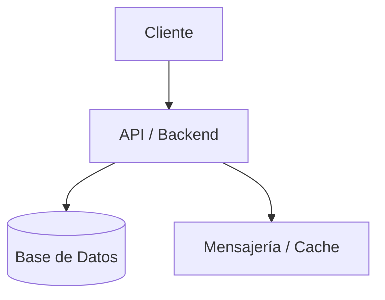
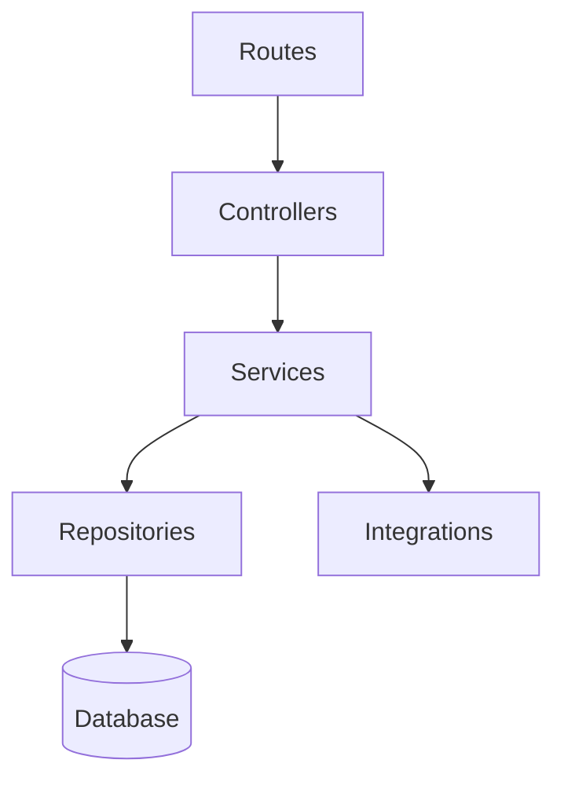

# Arquitectura del Proyecto – {{NOMBRE_DEL_PROYECTO}}

## 1. Información General

**Proyecto:** {{NOMBRE_DEL_PROYECTO}}

**Versión del Documento:** {{VERSION_DOCUMENTO}}

**Fecha:** {{FECHA}}

**Responsables:** {{EQUIPO / ÁREA}}

**Descripción General**  
Este documento describe la arquitectura técnica del proyecto **{{NOMBRE_DEL_PROYECTO}}**, incluyendo sus decisiones de diseño, estructura de componentes, flujos principales y estándares de desarrollo. El objetivo es servir como referencia corporativa para equipos técnicos, stakeholders y auditorías futuras.

---

## 2. Alcance del Documento

Este documento cubre:
- Arquitectura de software a nivel sistema
- Principales decisiones arquitectónicas (ADR)
- Estructura del proyecto y convenciones
- Patrones de diseño y principios técnicos

Fuera de alcance:
- Detalles de implementación específicos de bajo nivel
- Manuales de operación o despliegue

---

## 3. Contexto del Sistema (C4 – Nivel 1)

### 3.1 Descripción

{{DESCRIPCION_CONTEXTO}}

### 3.2 Diagrama de Contexto

```mermaid
graph LR
    Usuario[Usuarios / Sistemas Externos] --> Sistema[{{NOMBRE_DEL_PROYECTO}}]
    Sistema --> SistemasExternos[Sistemas Externos]
```

---

## 4. Contenedores del Sistema (C4 – Nivel 2)

### 4.1 Descripción de Contenedores

| Contenedor | Tecnología | Responsabilidad |
|-----------|------------|-----------------|
| API / Backend | {{TECNOLOGIA}} | {{RESPONSABILIDAD}} |
| Base de Datos | {{TECNOLOGIA}} | Persistencia de datos |
| Mensajería / Cache | {{TECNOLOGIA}} | Comunicación y cache |

### 4.2 Diagrama de Contenedores



---

## 5. Componentes Principales (C4 – Nivel 3)

### 5.1 Organización Lógica

El sistema se organiza siguiendo una arquitectura por capas con separación clara de responsabilidades.

| Capa | Responsabilidad |
|-----|-----------------|
| Routes | Exposición de endpoints / interfaces |
| Controllers | Orquestación de requests |
| Services | Lógica de negocio |
| Repositories | Acceso a datos |
| Integrations | Servicios externos |

### 5.2 Diagrama de Componentes



---

## 6. Stack Tecnológico

### 6.1 Tecnologías Principales

- Runtime: {{RUNTIME}}
- Lenguaje: {{LENGUAJE}}
- Framework: {{FRAMEWORK}}
- Persistencia: {{BASE_DE_DATOS}}
- Mensajería / Cache: {{CACHE}}

### 6.2 Herramientas de Soporte

- Testing: {{TESTING}}
- Linting / Formatting: {{LINTING}}
- Observabilidad: {{OBSERVABILIDAD}}

---

## 7. Estructura del Proyecto

```
{{NOMBRE_REPO}}/
├── src/
│   ├── routes/
│   ├── controllers/
│   ├── services/
│   ├── repositories/
│   ├── integrations/
│   ├── schemas/
│   ├── types/
│   ├── config/
│   └── app.ts
├── tests/
├── docs/
└── package.json
```

---

## 8. Convenciones de API

### 8.1 Convención de URLs

```
/api/{{VERSION_API}}/{modulo}/{recurso}
```

### 8.2 Estructura de Respuestas

**Respuesta Exitosa**
```json
{
  "data": {},
  "meta": {}
}
```

**Respuesta de Error**
```json
{
  "error": {
    "code": "ERROR_CODE",
    "message": "Descripción del error",
    "details": {}
  }
}
```

---

## 9. Seguridad

- Autenticación: {{JWT / OAuth / API Key}}
- Autorización: {{RBAC / ABAC}}
- Principio de mínimo privilegio aplicado

---

## 10. Manejo de Errores

| Código | Significado |
|------|-------------|
| 400 | Bad Request |
| 401 | Unauthorized |
| 403 | Forbidden |
| 404 | Not Found |
| 422 | Validation Error |
| 500 | Internal Server Error |

---

## 11. Principios Arquitectónicos

- Separación de responsabilidades
- Escalabilidad y mantenibilidad
- Observabilidad desde el diseño
- Seguridad por defecto

---

## 12. Architecture Decision Records (ADR)

Las decisiones arquitectónicas relevantes deben documentarse siguiendo el formato ADR.

### 12.1 Formato ADR

| Campo | Descripción |
|-----|------------|
| ID | ADR-XXX |
| Fecha | YYYY-MM-DD |
| Estado | Propuesto / Aceptado / Deprecado |
| Contexto | Situación que motiva la decisión |
| Decisión | Decisión tomada |
| Consecuencias | Impactos positivos y negativos |

### 12.2 Registro de ADRs

| ID | Fecha | Estado | Decisión |
|----|-------|--------|----------|
| ADR-001 | {{FECHA}} | Aceptado | {{DESCRIPCION_DECISION}} |

---

## 13. Notas y Consideraciones Finales

{{NOTAS_ADICIONALES}}

